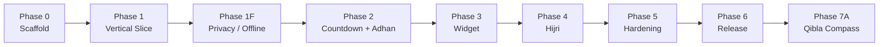
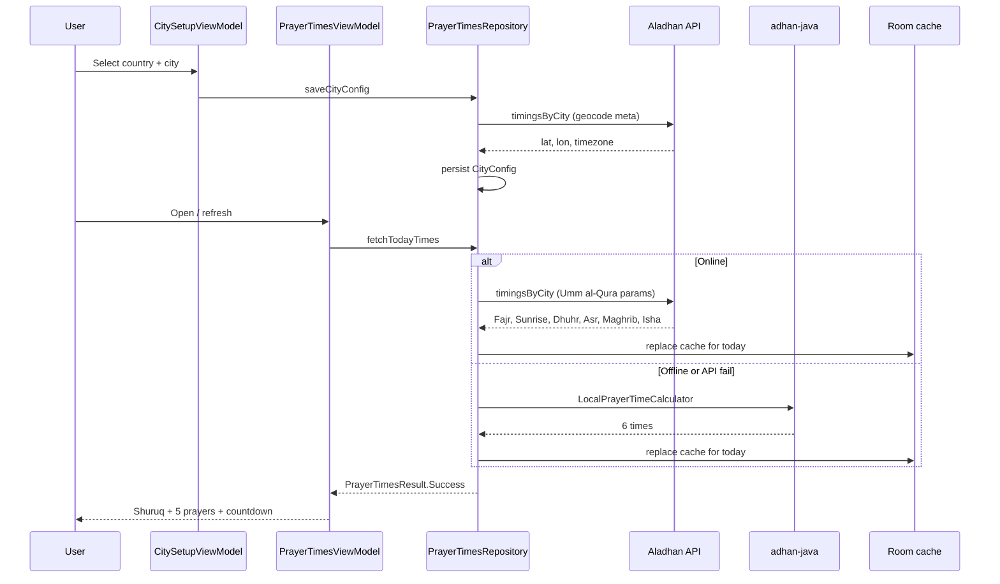
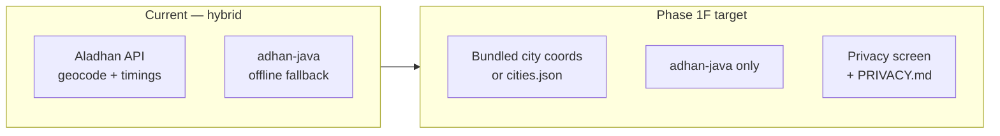

# Prayer Time Widget — Phased Implementation Plan

> **Current state:** Phases **0–7A** complete on `main` (Jun 2026). **`v1.0.0`** tagged. PR **#11** (Qibla), **#12** (audit v2), **#13** (L-widget layout + docs) merged. **No active feature phase** — branch new work from `main`. **Portrait-only** app (`MainActivity` `screenOrientation=portrait`).
> **Build:** Single APK `com.prayertime` (~23 MB debug). Privacy via Settings **offline-only toggle** (`offline_only`); no separate offline flavor.
> **Calculation:** Umm al-Qura + Shafi + twilight (≥48°N); `adhan-java` when offline-only; Aladhan API when user disables offline mode.
> **Tests:** `./gradlew testDebugUnitTest` — **413** JVM `@Test` (56 files); run `./scripts/smoke-ci.sh` for full gate.
> **Docs language:** English. **Architecture graphs:** Graphify + Mermaid below.
> **Phase 5 manual QA:** **5C.2**, **5D**, **5F.3** signed off Jun 2026 (user device verification).

---

## Open items (post Phase 2G)

| Area | Status |
|------|--------|
| **Phase 2H** pre–Phase 3 polish | **Complete** — merged to main |
| **Phase 3** widget | **Complete** — **two** providers (medium 5×1 + large), locale/digits, `STALE` cache fallback, `getCachedTodayTimes`, provider E2E + real worker stack (~30 widget-adjacent tests) |
| **Phase 4** Hijri + events | **Complete** — `HijriCalculator`, 10 events, Room v4, main + calendar + M/L widget, 19 tests |
| **Phase 5G** audit / architecture | **Complete (Jun 2026)** — see §5G; `FetchError`/`SaveCityError`, `Prayer.SHURUQ`, `TextNormalizer`, catalog validation, online save fallback, test infra (FakeRepo, VM integration, MockWebServer) |
| **Phase 5E** UI polish | **Complete (Jun 2026)** — theme/spacing, edge-to-edge, RTL, language picker, calendar layout, portrait lock; see §5E |
| **Phase 5** hardening | **Done** — 5A–5E automated tests, sound picker, per-prayer mute, audit remediation (Jun 2026), Room v1–v4 schema tests, smoke-ci green (**413** JVM tests). |
| **TLS pinning (6.8)** | **Done** | leaf + SPKI pins for aladhan.com in network_security_config.xml; rotation script at scripts/verify-aladhan-pins.sh |
| **BootCompletedReceiver fix** | **Done** | null-city and notifications-denied branches now cancel stale alarms |
| **Adhan sound picker** | **Done** | 8 sounds, live preview, persisted preference, AR/EN labels |
| **Per-prayer mute** | **Done** | 🔔/🔕 toggle per prayer, persisted to DataStore, receiver checks before sound/notification |
| **Custom adhan sounds** | **Done (PR #14)** — import `.mp3/.ogg/.wav` files, play from internal storage (`custom_adhans/`), fallback to default if missing, delete button in picker |
| **Comprehensive audit (Jun 2026)** | **Done** | `Audit.md` reconciled; score **100/100**; dead widget resource removed |
| **Adhan Doze fix (Jun 2026)** | **Done** | `USE_EXACT_ALARM` manifest; `setAlarmClock` Doze-safe; exact-alarm Settings notice; `ExactAlarmPermissionReceiver`; `qa-doze.sh` inexact-alarm warn |
| **5A manual Doze QA** | **Done (Jun 2026)** | 5A.1 accelerated day rollover (emulator); 5A.2 adhan in Doze offline + online; 5A.3 wakelocks clean both flavors |
| **5B permission denial QA** | **Done (Jun 2026)** | 5B.1 exact-alarm Settings guide; 5B.2 POST_NOTIFICATIONS; 5B.3 dual deny (offline + online) — times/UI stable, no crash |
| **5C.1 / 5C.3 offline QA** | **Done (Jun 2026)** | 5C.1 airplane-at-launch cache hit (online flavor); 5C.3 network restore, same six prayer clocks online vs offline |
| **5C.2 offline QA** | **Done (Jun 2026)** | 7-day airplane mode — cached days accessible; user sign-off |
| **5D DST QA** | **Done (Jun 2026)** | London spring/fall + manual TZ change on device; user sign-off |
| **5F.3 launcher QA** | **Done (Jun 2026)** | Widget on Pixel + Samsung One UI + Nova; user sign-off |
| **Widget picker previews** | **Done (5E.28)** | `widget_preview_*` layouts + `xml-v31` `previewLayout`; static light sample (runtime widgets follow user theme) |
| **Launcher icon** | **Done (5E.29)** | `ic_launcher_foreground` vector on green adaptive icon (replaces solid-white foreground) |
| **App themes (5E.16–19)** | **Done (Jun 2026)** | Light / Green / Dark — `AppTheme`, `ThemePalettes`, Settings picker, calendar + M/L widgets; per-theme column highlight on M/L widgets |
| **M-widget layout (5E.31–33)** | **Done (Jun 2026)** | 5×1 grid; 3 equal bands (header / names / times); short labels; **14sp** names+times; **time-only** (no column countdown); unified next-prayer highlight (`widget_highlight_*` overlay); phone QA signed off |
| **5F.1 API 23 QA** | **Done (Jun 2026)** | `PrayerTimeAPI23` emulator — signed release APK; AR prayer screen + Settings; M widget; adhan toggle (`ic_stat_adhan` fix) |
| **5F.2 API 34 QA** | **Done (Jun 2026)** | `PrayerTimeEmulator` (API 34) — release smoke, language picker, widget polish; emulator partial pass accepted |
| **Phase 6** release | **Done (`v1.0.0`)** | R8 + signed APK/AAB (~12 MB); PR #22 merged; tag pushed Jun 2026 |
| **i18n** | **Done (5E)** — EN/AR + RTL; Hijri calendar grid forced LTR (Sat→Fri); edge-to-edge insets |
| **Orientation** | **Portrait-only** — `android:screenOrientation="portrait"` on `MainActivity` |
| **Phase 7A** Qibla compass | **Merged (`main`, PR #11 Jun 2026)** — city-coordinate bearing + portrait accel/mag compass; dual-layer dial/arrow rotation; align haptic; EN/AR (`5419718`) |
| **7A follow-up (PR #12)** | **Merged (Jun 2026)** — audit v2 fixes: `LocationNames` → `domain/util`, startup language sync (no `runBlocking`), VM test seams, live HTTP opt-in, `MR_Zouerate` dedupe, M-widget empty `widget_prayer_block` GONE, `MediaPlayer` alarm attrs, `fallbackToDestructiveMigration`, +19 tests |
| **L-widget polish (PR #13)** | **Merged (Jun 2026)** — `widget_large_prayer_block.xml` shares M-widget 3-band column layout; readable L-widget fonts; `PrayerTimesViewModel` ticker test seam (fixes `runTest` hang) |
| **Gradle 9.5** | **Done** — `gradle-wrapper` 9.5.1 on `main`. **Dependabot AGP 9 / Compose BOM 2026 / coroutines 1.11** — close; pin stack AGP **8.7.3** + Kotlin **2.0.21** until coordinated upgrade |
| **Arabic city names** | **Done (7A)** — `cities_ar.json` + `LocationNames`; Arabic search/header/widget when app language is `ar` |

---

## Roadmap (phase graph)



---

## Runtime architecture

```mermaid
flowchart TB
    subgraph flavors [Product flavors]
        OFF[offline APK\nno INTERNET]
        ON[online APK\nRetrofit optional]
    end
    subgraph ui [UI — Compose main]
        MainActivity
        CityInputScreen
        PrayerTimesScreen
        SettingsScreen["Settings (AboutScreen)"]
    end
    subgraph vm [ViewModels main]
        CitySetupVM[CitySetupViewModel]
        PrayerTimesVM[PrayerTimesViewModel]
        SettingsVM[AppSettingsViewModel]
    end
    subgraph di [DI — Hilt main + flavor modules]
        PrayerTimeApplication
        DataModule
        RepositoryModule
    end
    subgraph data [Data main]
        PrayerTimesRepository
        LocalPrayerTimesRepository
        LocationDataSource
        CityConfigDataSource
        AppDatabase
    end
    subgraph onlineOnly [online flavor only]
        OnlinePrayerTimesRepository
        AladhanApi
        PrayerApi
    end
    subgraph domain [Domain main]
        LocalPrayerTimeCalculator
        PrayerTimeCalculator
        SearchLocationsUseCase
        TextNormalizer
    end
    OFF --> LocalPrayerTimesRepository
    ON --> OnlinePrayerTimesRepository
    OnlinePrayerTimesRepository -->|"composes"| LocalPrayerTimesRepository
    OnlinePrayerTimesRepository --> AladhanApi
    AladhanApi --> PrayerApi
    MainActivity --> PrayerTimeRoot
    PrayerTimeApplication --> RepositoryModule
    RepositoryModule --> LocalPrayerTimesRepository
    RepositoryModule --> OnlinePrayerTimesRepository
    PrayerTimeRoot --> CitySetupVM
    PrayerTimeRoot --> PrayerTimesVM
    PrayerTimeRoot --> SettingsVM
    CityInputScreen --> CitySetupVM
    PrayerTimesScreen --> PrayerTimesVM
    SettingsScreen --> SettingsVM
    CitySetupVM --> PrayerTimesRepository
    PrayerTimesVM --> PrayerTimesRepository
    SettingsVM --> PrayerTimesRepository
    LocalPrayerTimesRepository --> CityConfigDataSource
    LocalPrayerTimesRepository --> AppDatabase
    LocalPrayerTimesRepository --> LocationDataSource
    LocalPrayerTimesRepository --> LocalPrayerTimeCalculator
    LocalPrayerTimeCalculator --> PrayerTimeCalculator
```



---

## Prayer times data flow



---

## Graphify integration (knowledge graph)

Maintain an up-to-date code graph after each phase gate. Full CLI lifecycle: [`graphity.md`](graphity.md) (Graphify playbook).

| When | Command |
|------|---------|
| After Phase 1+ file changes | `OPENAI_API_KEY="" graphify update . --no-cluster --force` |
| Before merge / PR | `OPENAI_API_KEY="" graphify update . --no-cluster` |
| Visual audit (optional) | `GRAPHIFY_VIZ_NODE_LIMIT=15000 graphify cluster-only . --no-label` |

**Expected artifacts:** `graphify-out/graph.json`, `graphify-out/GRAPH_REPORT.md`, `graphify-out/graph.html`

**Agent rule:** Run Graphify update when architecture boundaries change (new packages, repository paths, or phase completion).

> **Last Graphify run:** 2026-06-08 — **5206** nodes, **75823** edges (post PR **#13** L-widget: `widget_large_prayer_block.xml`, `WidgetRemoteViewsBuilder` L bind). Install: `uv tool install graphifyy`. Commit `graphify-out/` with structural PRs.

---

## Post-7A — clean continuation baseline

**Branch from:** `main` (working tree clean after PR **#13** merge).

| Rule | Detail |
|------|--------|
| **Shipped** | Phases **0–7A**; release tag **`v1.0.0`** |
| **No active phase** | No scoped **7B** yet — define next phase in this file before coding |
| **Branching** | Feature branches only; `./scripts/smoke-ci.sh` before merge |
| **Graphify** | `OPENAI_API_KEY="" graphify update . --no-cluster` after package/layout changes |
| **Docs** | Update this file + `AGENTS.md` + playbook feature table on phase boundaries |

**Suggested next-work checklist (before first commit on a new branch):**

1. Add a **Phase 7B** (or maintenance) section here with tasks.
2. Run `./scripts/smoke-ci.sh` to confirm green baseline.
3. Run Graphify if touching `data/`, `domain/`, `ui/`, `widget/`, or `sensor/`.

---

## Phase 7A: Qibla compass (post-v1)

**Goal:** Show Qibla direction from saved city coordinates using device magnetometer — portrait hold, minimal scope.

**Branch:** `feat/qibla-compass` — user sign-off Jun 2026; do not revert compass UX without explicit user request (`5419718` message).

### Tasks

- [x] **7A.1** `QiblaCalculator` — bearing from city lat/lng to Kaaba (`atan2` formula); `QiblaCalculatorTest`
- [x] **7A.2** `CompassSensor` — `TYPE_ACCELEROMETER` + `TYPE_MAGNETIC_FIELD`, `getRotationMatrix` + `getOrientation` (no remap)
- [x] **7A.3** `CompassHeading` — magnetic azimuth + `GeomagneticField` declination → true north
- [x] **7A.4** `QiblaScreen` — dual rotation: dial `-azimuth`, arrow `qiblaBearing - azimuth`; 210ms smooth; blue top marker; green **Facing Qibla ✓** + one-shot haptic
- [x] **7A.5** Calibration UX — tips-only (figure-8 instructions); removed fake progress / auto-complete
- [x] **7A.6** `CompassEntryPoint` (Hilt); entry from `PrayerTimesScreen`; EN/AR strings (upright phone, rotate body not device)
- [x] **7A.7** CI hardening — `offlineOnly` DataStore default `true`; `PrayerTimeWidgetProviderTest` `Dispatchers.Unconfined`; theme/language SharedPreferences mirror via `apply()` + `@WorkerThread`
- [x] **7A.8** Merge `main` into branch (Gradle 9.5.1); **414** JVM unit tests (`testDebugUnitTest`)
- [x] **7A.9** Merge PR **#11** to `main` (Qibla core) — Jun 2026
- [x] **7A.10** Merge PR **#12** (post-7A audit remediation) — merged Jun 2026
- [x] **7A.11** L-widget layout parity (PR **#13**) — `widget_large_prayer_block.xml` `<include>` from `widget_prayer_times_large.xml`; M-aligned 3-band columns + readable fonts; VM ticker test seam

---

## Phase 0: Project Scaffolding

**Goal:** Create the Android project with build system, package structure, and all dependencies wired.

### Tasks

- [x] **0.1** Create Android project with Gradle Kotlin DSL
  - [x] Single `app/` module
  - [x] Min SDK 23, target SDK 35, compile SDK 35
  - [x] Kotlin, Jetpack Compose enabled
- [x] **0.2** Add dependencies (only what Phase 0 code actually uses):
  - `androidx.compose.*`, `androidx.lifecycle.viewmodel-compose`
  - `androidx.activity:activity-compose`, `androidx.core:core-ktx`
  - *Room/DataStore/WorkManager added in Phase 1 when first used*
- [x] **0.3** Create package structure:
  ```
  app/src/main/java/com/prayertime/
    ui/
      MainActivity.kt
    data/
      local/
      remote/
      repository/
    domain/
      model/
        CityConfig.kt
        PrayerTime.kt
        PrayerTimesResult.kt
      calculator/
    utils/
  ```
- [x] **0.4** Create `AndroidManifest.xml`, `proguard-rules.pro`, themes, strings
- [x] **0.5** Verify: `./gradlew assembleDebug` passes → **~22 MB debug APK produced** *(smoke-ci limit 25 MB)*

### Quality Gate (Phase 0) — ✅ SCREENING PASSED

**Build works.** Remaining items deferred to Phase 1 to avoid scope creep.

- [x] Build succeeds with zero errors (`./gradlew assembleDebug` passes)
- [x] Lint configured (detekt + ktlint plugins in app/build.gradle.kts)
- [x] Package structure — ui/, data/, domain/, utils/ populated with full Phase 1 code
- [x] APK generated: `app-offline-debug.apk` ~22 MB, `app-online-debug.apk` ~23 MB (smoke-ci limit 25 MB — passes)
- [x] `.gitignore` created (build/, .gradle/, *.iml, local.properties ignored)
- [x] Launcher icon added (adaptive icon via mipmap-anydpi-v26/ + colors.xml)
- [x] `./gradlew test` runs and passes (baseline; see Phase 1 gate for current count)

---

## Phase 1: Vertical Slice — City Input + Prayer Times Display

**Goal:** User selects country + city (wizard), sees 6 prayer times on screen (Fajr, Shuruq, Dhuhr, Asr, Maghrib, Isha).
No widget, no notifications — city wizard only.

### 1A — Contracts & Domain Models

- [x] **1A.1** `CityConfig` data class (cityName, countryCode, timezone, latitude, longitude)
- [x] **1A.2** `PrayerTimesResult` sealed class (Success / Error) + `FetchError` enum *(split from save path Jun 2026)*
- [x] **1A.3** `Prayer` enum (FAJR, SHURUQ, DHUHR, ASR, MAGHRIB, ISHA) *(renamed from DUHA Jun 2026)*
- [x] **1A.4** `PrayerTime` data class (prayer + displayTime + timestamp)

### 1B — Data Layer

- [x] **1B.1** `CityConfigSerializer` — DataStore save/read/clear city config
- [x] **1B.2** `PrayerTimeEntity` + `PrayerTimeDao` + `AppDatabase` — Room cache (last 7 days cleanup)
- [x] **1B.3** `AladhanApi` — Fetch city coordinates (latitude, longitude) & timezone via API meta on first setup
- [x] **1B.4** `NetworkMapper` — exception → `FetchError` (NETWORK / CITY_NOT_FOUND / INVALID_RESPONSE / UNKNOWN)
- [x] **1B.5** `PrayerTimesRepository` — hybrid: Aladhan first (online), adhan-java fallback; cache replace per day
- [x] **1B.6** Cache policy: delete-by-date before insert; clear all on city change; API params method=4, school=0, latAdj=3
- [x] **1B.7** Integrate `com.batoulapps.adhan:adhan:1.2.1` dependency in `build.gradle.kts`

### 1C — Domain Layer

- [x] **1C.1** `PrayerTimeCalculator.getNextPrayer(times, now)` — returns next `Prayer`
- [x] **1C.2** `PrayerTimeCalculator.getCountdown(nextPrayerTime, now)` — returns `Long`
- [x] **1C.3** `PrayerTimeCalculator.buildResult(times, now)` — returns `PrayerTimesResult` (Success with next+countdown or Error)
- [x] **1C.4** `LocalPrayerTimeCalculator` — Umm al-Qura + Shafi + `TWILIGHT_ANGLE` if |lat| ≥ 48°; second slot = **Sunrise (Shuruq)**

### 1D — UI Layer

- [x] **1D.1** `CityInputScreen` — country/city wizard: substring search, scrollable lists, custom "Use …" city fallback
- [x] **1D.2** `PrayerTimesScreen` — LazyColumn (6 rows: Fajr, Shuruq, Dhuhr, Asr, Maghrib, Isha) + per-prayer mute toggles + next prayer countdown + Change button
- [x] **1D.3** ViewModels — `CitySetupViewModel` (wizard), `PrayerTimesViewModel` (times + countdown), `AppSettingsViewModel` (About); states: Loading / NoCity / Success / Error
- [x] **1D.4** Error display: Snackbar with message per `FetchError` / `SaveCityError`
- [x] **1D.5** `MainActivity` — single Compose activity with state-driven screen switch

### 1E — Tests

- [x] **1E.1** Contract tests: `CityConfig` save/read parity (DataStore)
- [x] **1E.2** Calculator test: `getNextPrayer` mid-day → correct prayer (11 scenarios including Shuruq)
- [x] **1E.3** Calculator test: countdown at 0 seconds → no crash
- [x] **1E.4** Repository test: API returns 404 → `Error(CITY_NOT_FOUND)`
- [x] **1E.5** Repository test: API returns incomplete JSON → `Error(INVALID_RESPONSE)`
- [x] **1E.6** Repository test: offline → serves cached data

### Quality Gate (Phase 1) — ✅ PASSED

- [x] Calculator tests passing (11 tests, all green)
- [x] `./gradlew assembleDebug` succeeds
- [x] Repository + DataStore contract tests (7 tests, all green)
- [x] Local adhan-java calculation path tested (6 prayers including Shuruq)
- [x] Invalid city → geocode fails without persisting; Error + Snackbar; CITY_NOT_FOUND on fetch clears config without NoCity race
- [x] Manual: **Hameln, DE** — times match reference app (verified)
- [x] Manual: **Berlin, DE** — times match reference app (verified)
- [x] Manual: Select Country "Syria" -> Select City "Damascus" -> see 6 prayer times
- [x] Manual: Select custom city (non-existing) -> see Snackbar "City not found"
- [x] Manual: Kill app, reopen -> city persists
- [x] Manual: Tap "Change" -> returns to country selection
- [x] Manual: No network -> times appear (adhan-java calculated locally)
- [x] Graphify: `graphify update . --no-cluster` — see Phase 1F Quality Gate
- [x] Playbook feature table: Vertical Slice -> **Implemented**
- [x] No regressions in Phase 0

---

## Phase 1F — Privacy & Offline Independence

> **Goal:** Trustworthy app with optional **zero network** for prayer calculation; privacy policy states exactly what is sent (if anything) and when.
> **Motivation:** User-owned prayer times without depending on untrusted third-party apps.



**Current network surface (before 1F):**

| What | Where | Network? |
|------|-------|----------|
| Daily timings (preferred) | Aladhan `GET /v1/timingsByCity` | Yes |
| Geocode (lat, lon, tz) | Same response `meta` | Yes |
| Offline fallback | `adhan-java` (Umm al-Qura + Shafi + twilight ≥48°) | No |
| Shuruq row | Aladhan `Sunrise` field or local sunrise | Yes / local |

### 1F-A — Privacy policy (transparency)

- [x] **1F-A.1** Add `docs/PRIVACY.md` (English primary; optional Arabic summary)
- [x] **1F-A.2** In-app **About / Privacy** screen: readable summary + link to doc
- [x] **1F-A.3** Policy table:

  | Event | Data sent | Destination | Can disable? |
  |-------|-----------|-------------|--------------|
  | Save city (network mode) | City name + country code | `api.aladhan.com` | Yes (offline-only mode) |
  | Fetch timings (network mode) | Same + method/school/latAdj | `api.aladhan.com` | Yes |
  | Local calculation | Nothing | — | Default in offline-only |
  | GPS | **Never** | — | — |

- [x] **1F-A.4** Explicit: no analytics, no ads, no Firebase — manifest + policy

### 1F-B — Remove Aladhan dependency (100% local)

- [x] **1F-B.1** `offline_only` flag (DataStore): when on → **zero** HTTP requests
- [x] **1F-B.2** Skip `fetchFromApi` in `PrayerTimesRepository` when `offline_only=true`
- [x] **1F-B.3** Local geocode: `LocationDataSource` ~316 `CityCoords` entries + country-centroid defaults
- [x] **1F-B.4** `saveCityConfig`: persist coordinates from local source in offline mode
- [x] **1F-B.5** `fetchTodayTimes`: always `LocalPrayerTimeCalculator` + Room cache when `offline_only=true`
- [x] **1F-B.6** Retrofit/Gson/OkHttp → `onlineImplementation` only; offline classpath clean (no Gson/Retrofit/OkHttp) — ✅ PASSED
- [x] **1F-B.7** Tests: `offline_only` → no `AladhanApi` calls

### 1F-C — Permissions & manifest

- [x] **1F-C.1** Product flavor `offline` without `INTERNET` permission (done)
- [x] **1F-C.2** Or keep `INTERNET` but disabled logically in `offline_only` + document in policy
- [x] **1F-C.3** UI badge: **"Privacy mode — no network"** when enabled

### 1F-D — Accuracy after split

- [x] **1F-D.1** Hameln + Berlin verified vs reference app (≤ few minutes)
- [x] **1F-D.2** Damascus / Mecca -- automated structural test (order, 6 prayers, ±24h window)
- [x] **1F-D.3** Document method in policy: Umm al-Qura + Shafi + twilight (|lat| ≥ 48°)
- [x] **1F-D.4** Update `AGENTS.md` + README: no Aladhan in default target mode

### 1F-E — Tests

- [x] **1F-E.1** Repository: `offline_only` → 6 times from adhan-java only
- [x] **1F-E.2** Change city → cache cleared + recalc without HTTP
- [x] **1F-E.3** Airplane mode: manually verified
- [x] **1F-E.4** Offline saveCityConfig test: a city listed in picker but absent from `knownCityCoords` → `CITY_NOT_FOUND` (e.g. a non-DE country city without exact coord entry)
- [x] **1F-E.5** Repository Rejection test: `saveCityConfig` rejects `LocationDataSource.Fallback` → `CITY_NOT_FOUND` (offline + online/geocode-fail paths); no DataStore write
- [x] **1F-E.6** Umlaut parity test: every city in `citiesByCountry["DE"]` resolves to `CityResolutionResult.Found` (diacritic folding in `foldForLookup`)
- [x] **1F-E.7** Online-mode save: network error → fall back to local coordinates (`resolveCoordinates` returns `GeocodeResult.Error` only from actual API failure, not from absent network; local fallback in `LocationDataSource` consulted)

### Quality Gate (Phase 1F)

- [x] Privacy policy published (`docs/PRIVACY.md` + in-app screen)
- [x] Offline-only mode works E2E: country/city → times → reopen
- [x] No requests to `api.aladhan.com` in default target mode
- [x] `./gradlew testOfflineDebugUnitTest testOnlineDebugUnitTest` green
- [x] Graphify updated after structural change *(organizational, not proven by CI)*
- [x] Playbook: **Privacy / Offline-first → Implemented**
- [x] Umlaut key mismatch fixed (`Osnabruck`/`Saarbrucken` → exact lookup keys aligned)

---

## Phase 2: Countdown + Adhan Notifications

**Goal:** Main screen shows live countdown to next prayer. Adhan fires at prayer time.

### 2A — Countdown

- [x] **2A.1** `LaunchedEffect` loop in UI — updates every second, wraps to tomorrow's first prayer after Isha
- [x] **2A.2** UI: display "Next prayer: Asr in 2h 14m" below the prayer table
- [x] **2A.3** Day-change detection via `needsPrayerDayRefresh()` in city `timezone` triggers `refreshTimesForNewDay()` at city calendar midnight (silent refresh — no Loading flash)

### 2B — Adhan Notification

- [x] **2B.1** Create notification channel "Adhan" (importance HIGH)
- [x] **2B.2** Implement `AdhanAlarmReceiver` — BroadcastReceiver that shows notification
- [x] **2B.3** Schedule exact alarm via `AlarmManager.setExactAndAllowWhileIdle()`
- [x] **2B.4** Audio: include Adhan MP3 in `res/raw/`, play via `MediaPlayer`

### 2C — Permission Handling

- [x] **2C.1** `SCHEDULE_EXACT_ALARM` dialog on Android 12+:
  - [x] If granted → use `setExactAndAllowWhileIdle()`
  - [x] If denied → use `setAndAllowWhileIdle()` (approximate), show in-app notice
- [x] **2C.2** `POST_NOTIFICATIONS` dialog on Android 13+:
  - [x] If denied → notification skipped; in-app notice on About when toggle on

### 2D — Daily Refresh (WorkManager)

- [x] **2D.1** `PrayerTimeRefreshWorker` — `PeriodicWorkRequest` every 24h
- [x] **2D.2** Expedited policy deferred (PeriodicWork does not support expedited; 24h periodic is sufficient)
- [x] **2D.3** Fallback: on app launch, if last fetch > 25h ago → fetch immediately

### 2E — Tests

- [x] **2E.1** Countdown: midnight boundary — `PrayerTimeCalculator.isSameDay()` unit tests (4 tests: same day, across midnight, same-day wrap, year boundary)
- [x] **2E.2** Countdown: city TZ day rollover — `PrayerTimesViewModel.refreshIfPrayerDayStale()` uses `config.timezone` via `needsPrayerDayRefresh()`; tests cover city vs UTC mismatch. **Audit (device TZ ≠ city TZ): resolved** — e.g. London device + Makkah (`Asia/Riyadh`) refreshes at Riyadh midnight, not London midnight.
- [x] **2E.3** Countdown: DST transition day (Europe/London, March 31st) — 4 tests: same-day across DST gap, before/after gap still same day, day-before vs DST-day separation, countdown across DST gap
- [x] **2E.4** Notification: alarm scheduling — `PrayerAlarmSchedulerTest` (Robolectric `ShadowAlarmManager`): future prayer count (all six slots incl. Shuruq), trigger timestamps, `RTC_WAKEUP`, exact vs inexact fallback

### Quality Gate (Phase 2)

- [x] Countdown implemented with wrap-to-tomorrow and midnight-safe handling
- [x] **Manual:** Adhan notification fires at exact prayer time (grant permission) — `./scripts/emu`, About → Adhan ON
- [x] **Manual:** Fallback works when permission denied (inexact alarms + red About hints)
- [x] **Manual:** Daily refresh — kill app, advance clock >25h or wait; reopen → times refresh
- [x] Playbook feature table: Countdown → **Implemented**
- [x] Playbook feature table: Adhan → **Implemented**
- [x] No regressions in Phase 1 — `./scripts/smoke-ci.sh` (303 / 344 tests, both APKs)

---

## Phase 2G — Hilt DI & test coverage

**Goal:** Replace manual service-locator wiring with Hilt; expand repository/worker test coverage; explicit cache invalidation for manual refresh.

### 2G-A — Dependency injection

- [x] **2G-A.1** Hilt 2.52 — `@HiltAndroidApp` on `PrayerTimeApplication`; `HiltWorkerFactory` for WorkManager
- [x] **2G-A.2** `di/` modules: `DataModule`, `DomainModule`, `AppConfigModule` (main); flavor `RepositoryModule` (offline/online); `NetworkModule` (online)
- [x] **2G-A.3** `@HiltViewModel` + `hiltViewModel()` for all ViewModels; `@AndroidEntryPoint` on `MainActivity`, `BootCompletedReceiver`
- [x] **2G-A.4** `@HiltWorker` on `PrayerTimeRefreshWorker`; removed `PrayerTimeViewModelFactory` and flavor `PrayerTimeApp.kt` entry points

### 2G-B — Cache & refresh

- [x] **2G-B.1** `invalidateTodayCache(config)` on `PrayerTimesRepository` — drops today's Room rows without clearing city config
- [x] **2G-B.2** About → **Refresh today's times** wired to `PrayerTimesViewModel.refreshTimes()` (`bypassCache = true`)
- [x] **2G-B.3** `clearCityConfig()` clears DataStore only; Room cache retained by design
- [x] **2G-B.4** `OnlinePrayerTimesRepository` shares single `PrayerTimesLocalEngine` with composed `LocalPrayerTimesRepository`

### 2G-C — Tests

- [x] **2G-C.1** `PrayerTimesLocalEngineTest` — cache hit, cleanup, clearCityCache, getLatestDateLabel
- [x] **2G-C.2** `PrayerRefreshWorkTest` — periodic work registration, KEEP policy
- [x] **2G-C.3** `PrayerTimeRefreshWorkerTest` — refresh / retry / skip paths via `TestListenableWorkerBuilder`
- [x] **2G-C.4** `AladhanTimingsMapperTest` — null/unparseable date edge cases
- [x] **2G-C.5** `OnlinePrayerTimesRepositoryTest` — geocode IOException fallback (Berlin)

### Quality Gate (Phase 2G)

- [x] `./scripts/smoke-ci.sh` green (detekt, ktlint, lint, build, tests, APK size)
- [x] 303 shared / 344 online unit tests (41 online-only in `testOnline/`)
- [x] Graphify updated after Hilt + di/ package addition
- [x] Playbook feature table: Hilt DI, worker tests, manual cache refresh → **Implemented**

---

## Phase 2H — Pre–Phase 3 polish (complete)

**Goal:** Close architecture and UX gaps found in manual QA before widget work. **Not a release phase** — Phases 5–6 remain required for a complete app.

### 2H-A — Architecture & data

- [x] **2H-A.1** `LocationRepository` in domain; `LocalLocationRepository`; `SearchLocationsUseCase` no longer depends on `LocationDataSource` directly
- [x] **2H-A.2** Hilt `NetworkModule` — shared `OkHttpClient` / `Retrofit` / `AladhanApi` (remove `AladhanApi.create()`)
- [x] **2H-A.3** Room `exportSchema = true` + `app/schemas/` v3 JSON in VCS
- [x] **2H-A.4** Remove dead `lastFetchEpochMs` / `recordFetchSuccess`
- [x] **2H-A.5** Online save: single geocode + timings fetch; `fetchTodayTimes` serves Room cache before network
- [x] **2H-A.6** Countdown ticker: wall-clock aligned `delay` (no drift)
- [x] **2H-A.7** `Prayer` enum in `Prayer.kt` (split from `PrayerTime.kt`)

### 2H-B — UI, locale, permissions

- [x] **2H-B.1** Prayer header layout — city full width; actions on second row (fixes truncated “Ha / m…”)
- [x] **2H-B.2** **Language** control + `LanguagePickerDialog` (system / en / ar); `AppLocale` + DataStore `app_language_tag`
- [x] **2H-B.3** AppCompat per-app locale — `AppCompatActivity`, AppCompat theme, `locales_config.xml`
- [x] **2H-B.4** Manual sign-off: Arabic UI on emulator after recreate (prayer screen + About)
- [x] **2H-B.5** RTL layout pass — prayer header, About, wizard (`TextAlign.Start`, trailing action row, `SpaceBetween` rows, `LocalLayoutDirection` in root; M/L widget `layoutDirection=locale`; ties to 5E.4)
- [x] **2H-B.6** Adhan toggle: no crash — stop auto-launching battery + exact-alarm settings; `safeStartActivity`
- [x] **2H-B.7** `privacy_full_policy` strings — no broken `docs/PRIVACY.md` path in UI
- [x] **2H-B.8** `./dev` — emulator boot + `installOfflineDebug` + launch

### 2H-C — Tooling & docs

- [x] **2H-C.1** `smoke-ci` / detekt / ktlint fixes on branch
- [x] **2H-C.2** Graphify + `graphity.md` + this plan — updated in PR
- [x] **2H-C.3** User manual sign-off on branch before merge to `main`

### Quality Gate (Phase 2H)

- [x] `./scripts/smoke-ci.sh` green on PR
- [x] `./dev` — Language → العربية → UI Arabic; About + Adhan toggle stable
- [x] Playbook: new rows truthful (`Partial` where applicable)
- [x] **Explicit:** Phases **0–4** complete; Phases **5–6** still **Planned** — do not mark app “complete”

---

## Phase 3: Home Screen Widget

**Goal:** Widget on the home screen shows next prayer + countdown + today's times.
*Starts after Phase 2H quality gate (or explicit waiver) — Phase 1 + Phase 2 gates already green.*

### 3A — Widget Implementation

- [x] **3A.1** Four `AppWidgetProvider` classes — `PrayerTimeWidgetProvider` (medium), `PrayerTimeWidgetProviderSmallTall` (2×3), `PrayerTimeWidgetProviderSmallWide` (4×1), `PrayerTimeWidgetProviderLarge` (6×3) — all extend base provider; delegate to `WidgetUpdater` via Hilt `WidgetEntryPoint`
- [x] **3A.2** Four widget layouts — `widget_prayer_times_medium.xml` (6-column grid: prayer name above time, city label, next-prayer highlight), `_small_tall.xml` (next prayer + hour/min countdown), `_small_wide.xml` (next prayer + compact countdown line), `_large.xml` (same as medium + clock display); empty/error states for all sizes
- [x] **3A.3** Widget configuration activity — deferred (tap widget opens app)
- [x] **3A.4** `WidgetLocaleContext` — per-app locale resolution for RemoteViews strings (AppCompat application locales, API 23+ fallback)
- [x] **3A.5** `WidgetDigitFormatter` + `Context.localizeWidgetDigits` — Eastern Arabic digit substitution on M/L time + countdown fields when language is Arabic

### 3B — Widget Updates

- [x] **3B.1** `WidgetUpdateWorker` (`@HiltWorker`) + `WidgetRefreshWork` — 30 min `PeriodicWorkRequest`; enqueued via `PrayerTimeApplication` init side-effect
- [x] **3B.2** `WidgetPrayerBoundaryScheduler` + `WidgetPrayerBoundaryReceiver` — exact alarm at next prayer boundary triggers immediate update
- [x] **3B.3** `WidgetSnapshotLoader.load()` calls `repository.fetchTodayTimes(config)` — reads from Room cache or calculates fresh
- [x] **3B.4** `widgetSizeFor` dispatches to correct layout via provider class name; `AppWidgetManager.getAppWidgetInfo` width-DP fallback for unrecognized launchers
- [x] **3B.5** `WidgetSnapshot.State.STALE` — on fetch error, `getCachedTodayTimes()` fallback; M/L show cached times + stale banner; ERROR retains Hijri on M/L when times unavailable

### 3C — Tests (~18 widget-adjacent)

- [x] **3C.1** `WidgetSnapshotLoaderTest` (4 tests) — NO_CITY / READY / ERROR with Hijri / STALE cache fallback
- [x] **3C.2** `WidgetPrayerBoundarySchedulerTest` (3 tests) — next future prayer, wrap-to-tomorrow, empty list
- [x] **3C.3** `CountdownFormatterTest` (3 tests) — hours+minutes, minutes-only, formatCompact no-spaces variant
- [x] **3C.4** `WidgetRefreshWorkTest` — real `WidgetUpdater` + boundary scheduler (no mockk); verifies widget view + alarm
- [x] **3C.5** `PrayerTimeWidgetProviderTest` — E2E via `performUpdate` / `onUpdate` + `ShadowAppWidgetManager`
- [x] **3C.5** `WidgetDigitFormatterTest` (1 test) — Western → Eastern Arabic digit substitution
- [x] **3C.6** `AppSettingsViewModelTest.applyAppLanguage` — verifies WidgetUpdater refresh on locale change
- [x] **3C.7** `WidgetRemoteViewsBuilderTest` — smoke: all states × four sizes build without error (Robolectric + `includeAndroidResources`)

### Quality Gate (Phase 3)

- [x] Widget displays on home screen at four sizes — `updatePeriodMillis=1800000` + `WidgetRefreshWork` periodic
- [x] Widget shows correct next prayer + countdown — size-specific bind methods in `WidgetRemoteViewsBuilder`
- [x] Widget updates immediately when prayer time hits — `WidgetPrayerBoundaryScheduler` exact alarm
- [x] Widget shows cached data in airplane mode — Room via `fetchTodayTimes`; STALE path via `getCachedTodayTimes` on error
- [x] Widget locale mirrors app language (EN/AR) with Eastern Arabic digits on M/L columns — `WidgetLocaleContext` + `WidgetDigitFormatter`
- [x] Playbook feature table: Widget → **Implemented**
- [x] No regressions in Phase 1 or 2 — build + tests green
- [x] Graphify updated — widget package + four providers (2026-06-04)

---

## Phase 4: Hijri Calendar & Events

**Goal:** Main screen and widget display Hijri date + countdown to Islamic events.

### 4A — Hijri Calculation

- [x] **4A.1** `HijriCalculator` — tabular Islamic calendar (Kuwaiti algorithm); Gregorian ↔ Hijri conversion, leap year detection
- [x] **4A.2** Compute 10 Islamic events: Islamic New Year, Ashura, Mawlid, Isra & Miraj, Mid-Shaban, Ramadan, Laylat al-Qadr, Eid al-Fitr, Day of Arafah, Eid al-Adha; `nextUpcomingEvent()` finds the next event from today
- [x] **4A.3** Store Hijri date in Room — `PrayerTimeEntity` v3→v4 migration adds `hijriYear/Month/Day` columns; populated on cache via `PrayerTimesLocalEngine`

### 4B — UI Integration

- [x] **4B.1** Main screen: Hijri date subtitle below city name (e.g. "14 Ramadan 1445") via `HijriDateFormatter` + string resources (EN/AR)
- [x] **4B.2** Event banner: "Eid al-Fitr in 5 days" in accent color below Hijri date
- [x] **4B.3** Widget: Hijri date + event countdown on Medium (compact) and Large (full); city replaced by Hijri on Medium
- [x] **4B.4** Full monthly Hijri calendar screen — dark green theme, Arabic/English day headers, Friday in gold, each cell shows Hijri day + Gregorian date + event badge pill, Ramadan first/last day markers, tap event days for details dialog, `CalendarColors` object for future theming

### 4C — Tests

- [x] **4C.1** HijriCalculator: epoch (1 Muharram 1 AH), 1 Ramadan 1445 = March 11 2024
- [x] **4C.2** HijriCalculator: 1 Shawwal 1445 = April 10 2024, Eid al-Adha = June 17 2024
- [x] **4C.3** Event display: 30 days from 1 Ramadan → 1 Shawwal; next event ordering verified
- [x] **4C.4** Full Hijri year cycle (leap + regular), round-trips, month boundaries, migration v3→v4

### Quality Gate (Phase 4)

- [x] Hijri date displays correctly on main screen (EN + AR)
- [x] Event countdowns accurate (Ramadan, Eid, full 10-event cycle)
- [x] Widget shows Hijri info (M/L)
- [x] Monthly calendar with event markers, tap-to-detail
- [x] Playbook feature table: Hijri Calendar → **Implemented**
- [x] No regressions in prior phases — smoke-ci green
- [x] Graphify updated — `HijriCalculator`, calendar UI, Room v4 (2026-06-04)

### Phase 4 → 5 handoff

Phases **0–4** are complete. **5G** and **5E** code complete (portrait-only). **5A**–**5F** manual QA signed off (Jun 2026, incl. **5C.2**, **5D**, **5F.3**). **Phase 6** released (`v1.0.0`).

---

## Phase 5: Hardening & Polish

**Goal:** Production-quality stability, performance, and UX. **Complete** — code, emulator, and device manual QA signed off Jun 2026.

### 5G — Architecture & audit hardening (complete Jun 2026)

**Goal:** Close comprehensive codebase audit (2026-06-04) — runtime risks, architectural leaks, test gaps. **Not a release gate** — manual QA in 5A–5F still required.

#### Critical / high (runtime)

- [x] **5G.1** `cacheToRoom` atomic — `database.withTransaction`
- [x] **5G.2** `AladhanTimingsMapper.toTimestamp` — validate parse; return null on malformed input
- [x] **5G.3** `HijriCalculator.jdnToGregorian` — noon UTC offset fix
- [x] **5G.4** `CitySetupViewModel` — resolve coords before save (no UTC draft leak)
- [x] **5G.5** `CityConfig.hasValidCoordinates` → `FetchError.MISSING_COORDINATES`
- [x] **5G.6** DST-safe boundaries — `PrayerTimeCalculator.nextBoundaryTimestamp` + calendar-day advance (widget + cleanup)
- [x] **5G.7** Adhan toggle — immediate UI state in `AppSettingsViewModel`

#### Medium / architecture

- [x] **5G.8** `LocationDataSource` — load failure handling; `awaitReady()` always completes
- [x] **5G.9** `LocationCatalogLoader` — JSON structure validation + `InvalidCatalogException`
- [x] **5G.10** `PrayerTimesViewModel` — event channel replaces suppress flag
- [x] **5G.11** `WidgetPrayerBoundaryReceiver` — `goAsync()` + per-receive coroutine scope
- [x] **5G.12** `OnlinePrayerTimesRepository` — `CancellationException` rethrow; `fallbackSave()` preserves wizard coords
- [x] **5G.13** `resolveLocalCoordinates` — skip re-geocode when coords already valid
- [x] **5G.14** `TextNormalizer.foldForLookup` — shared locale util (data + search)
- [x] **5G.15** Split errors — `FetchError` vs `SaveCityError`; `Prayer.SHURUQ` (+ legacy `"DUHA"` Room read)
- [x] **5G.16** Widget builder — single `localized()` per update; small-widget stale banner; negative countdown coerce
- [x] **5G.17** Debug HTTP logging — `HttpLoggingInterceptor` (online debug builds)

#### Test infrastructure

- [x] **5G.18** `FakePrayerTimesRepository` — replaces 5 inline fakes
- [x] **5G.19** `PrayerTimesViewModelIntegrationTest` — real Room + local repo
- [x] **5G.20** `AladhanApiMockWebServerTest` — Retrofit + Gson wire path
- [x] **5G.21** `WidgetSnapshotLoaderIntegrationTest` — real loader + builder chain
- [x] **5G.22** `LocationCatalogLoaderTest` — malformed JSON cases

- [x] **5G.D2** `CityConfig` nullable coords API (`m-2`) — `latitude`/`longitude` optional; `hasValidCoordinates` guards fetch/save (Jun 2026)

### Quality Gate (Phase 5G)

- [x] `./gradlew testDebugUnitTest` — **413** green (single APK / single test source set)
- [x] `./scripts/smoke-ci.sh` green
- [x] Graphify updated (2026-06-04 post-5G)
- [x] AGENTS.md + PHASED_PLAN.md test counts and Room v4

#### 5G addendum — Jun 5 session

- [x] **5G.23** Bismillah header — `BismillahHeader` composable on all 5 screens
- [x] **5G.24** Annual Events page — Compose-rendered (10 events, color-coded, locale-aware)
- [x] **5G.25** Crescent icon — plain crescent replaces star+crescent in Bismillah + Eids
- [x] **5G.26** Event dialog — shows "X days from now / ago" for tapped event
- [x] **5G.27** AppPreferencesDataSource DI — @Inject instead of manual construction
- [x] **5G.28** network_security_config.xml — cleartext blocked; TLS pin-set for `aladhan.com` (see §6.8)
- [x] **5G.29** Countdown ticker — SystemClock.elapsedRealtime() for drift-resistant tick
- [x] **5G.30** PrayerTimeRefreshWorkerTest — runTest replaces runBlocking; removed deadlock
- [x] **5G.31** Hardcoded strings to resources — AnnualEventsView sub-labels + legend
- [x] **5G.32** setAlarmClock guard — SecurityException caught, falls back to inexact alarm
- [x] **5G.33** Dead fixture — incomplete_timings.json replaced with live partial-map test
- [x] **5G.34** @WidgetScope shared scope — Hilt @Singleton injected into widget + receivers
- [x] **5G.35** foldForLookup fix — moved from LocationRepository domain to SearchLocationsUseCase
- [x] **5G.36** WidgetSnapshotLoader — pre-existing config.timezone scope bug fixed
- [x] **5G.37** testInstrumentationRunner — added for instrumented tests

#### 5G addendum — Jun 6 session (comprehensive audit)

- [x] **5G.38** `AdhanAlarmReceiver` — `goAsync()` + `@WidgetScope` coroutine (mute check off main thread)
- [x] **5G.39** `LocationCatalogInitializer` — catalog load at app startup; `LocalLocationRepository` no ctor `init`
- [x] **5G.40** Room migration coverage — exported schemas **1–4**; instrumented `migrate1To2` / `migrate2To3` / `migrate3To4`
- [x] **5G.41** Widget bind-time theme — `readAppThemeSync()` SharedPreferences mirror; `widget_initial_*` + sync `applyThemeChrome()`
- [x] **5G.42** `LocationDataSource` — `loadGeneration` token; stale async loads ignored after `resetForTests()`
- [x] **5G.43** Graphify updated — **3321** nodes, **50433** edges (2026-06-06)

#### 5G addendum — Jun 7 session (audit v2 + 7A follow-up)

- [x] **5G.44** `LocationNames` → `domain/util/` — removes domain→locale leak in `SearchLocationsUseCase`
- [x] **5G.45** Startup language — `resolveLanguageTagForStartupSync()` (no `runBlocking` on main); async DataStore seed on IO
- [x] **5G.46** `PrayerTimesViewModel` test seams — `seedSuccessStateForTest` / `seedLiveCountdownForTest` (no reflection)
- [x] **5G.47** Live HTTP tests opt-in — `PRAYERTIME_LIVE_HTTP=1`; `LiveAladhanTestSupportTest`
- [x] **5G.48** `AdhanPermissions.canScheduleExactAlarms` delegates to `PrayerAlarmScheduler.canUseExactAlarms`
- [x] **5G.49** `locations.json` — remove duplicate `MR_Zouerat` (keep `MR_Zouerate`)
- [x] **5G.50** `OnlinePrayerTimesRepository` — `REQUIRED_PRAYER_COUNT = 6` (not `Prayer.entries.size`)
- [x] **5G.51** Room dev safety — `fallbackToDestructiveMigration()` in `DataModule`
- [x] **5G.52** M-widget empty state — `bindEmpty(MEDIUM)` hides `widget_prayer_block`
- [x] **5G.53** `AdhanAlertDeliverer` — `MediaPlayer()` + `setAudioAttributes` before `prepare()` (API 21–28 alarm routing)
- [x] **5G.54** Test coverage — `AdhanSoundResolverTest`, `HijriDateFormatterTest`, `PrayerTimesErrorMapperTest`, `LocationNamesTest`, `CityConfigSerializer` edge cases (+19 tests; **413** total after PR **#13** VM test refactor)
- [x] **5G.55** Dependabot policy — ignore major/minor AGP, Compose BOM, coroutines bumps (pin AGP 8.7.3 stack)

---

### 5A — Doze Mode & Battery

QA helper: `./scripts/qa-doze.sh` (`audit`, `5a1-guide`, `5a2`, `doze-on`/`doze-off`, `alarms`, `wakelocks`).

- [x] **5A.1** Test: app in Doze mode for 8+ hours → times still correct on wake — **signed off Jun 2026** (emulator accelerated: `doze-on` → +1 day → times/countdown/widgets correct; `./scripts/qa-doze.sh 5a1-guide`)
- [x] **5A.2** Test: AlarmManager triggers in Doze — **signed off Jun 2026** (offline + online; `window=0` + `Alarm clock:`; notification + adhan in Doze; `./scripts/qa-doze.sh 5a2`)
- [x] **5A.3** No wakelock leaks; minimal background work — static audit **passed**; **runtime signed off Jun 2026** (no partial wakelocks; periodic WM jobs only; `./scripts/qa-doze.sh wakelocks`)

### 5B — Permission Denial Flows

- [x] **5B.1** Test: deny `SCHEDULE_EXACT_ALARM` → approximate alarm + Settings guide — **signed off Jun 2026** (emulator: exact-alarm notice shown; user enabled in system Settings; adhan reschedules with `window=0` after grant; default install also has `USE_EXACT_ALARM`)
- [x] **5B.2** Test: deny `POST_NOTIFICATIONS` → no crash, indicator shown *(toggle no longer auto-starts missing activities; notice links remain)*
- [x] **5B.3** Test: deny both → app still functional (displays times) — **signed off Jun 2026** (emulator offline + online: `pm revoke POST_NOTIFICATIONS`, `appops deny SCHEDULE_EXACT_ALARM`, App info Notifications Off; six times + countdown EN/AR; Settings/adhan toggle stable; no crash)

### 5C — Offline Robustness

QA helper: `./scripts/qa-offline.sh` (`audit`, `5c1`, `5c2-guide`, `5c3`, `network-off`/`network-on`, `cache-dump`). **Online** APK (`com.prayertime`) required for network-mode paths; offline APK always calculates locally.

- [x] **5C.1** Test: airplane mode at launch → cached times shown — **signed off Jun 2026** (online flavor, `./scripts/qa-offline.sh 5c1`; cache hit → times on screen, no Snackbar — expected). Snackbar only on `FetchError` (no coords + no cache). Widget uses STALE label on fetch error + cache.
- [x] **5C.2** Test: airplane mode for 7 days → 7 days of cached data accessible — **signed off Jun 2026** (`./scripts/qa-offline.sh 5c2-guide`; retention unit-tested in `PrayerTimesLocalEngineTest`; user device verification)
- [x] **5C.3** Test: re-enable network → fresh fetch on next launch — **signed off Jun 2026** (`./scripts/qa-offline.sh 5c3`; same six prayer clocks online vs offline/adhan after network restore). **Note:** online repo is cache-first; API refetch needs empty today cache (new city day or Settings → Refresh today's times)

### 5D — DST & Time Zone

- [x] **5D.1** Test: `Europe/London` on March 31st (DST spring forward) — **signed off Jun 2026** (user device verification)
- [x] **5D.2** Test: `Europe/London` on October 27th (DST fall back) — **signed off Jun 2026** (user device verification)
- [x] **5D.3** Test: manual time zone change → times recalculate correctly — **signed off Jun 2026** (user device verification)

### 5E — UI Polish (batches)

- [x] **5E.1** Layout & spacing rhythm — `AppSpacing` tokens; 16 dp screen padding across prayer, wizard, About, calendar
- [x] **5E.2** Visual hierarchy (titles, accents, emphasis) — `PrayerTimeTheme` green Material3 scheme aligned with calendar palette
- [x] **5E.3** Button states and feedback clarity — `AppTextButton` 48 dp min touch target on all text actions
- [x] **5E.4** Responsive behavior (cutouts, RTL for Arabic, portrait-only) — `enableEdgeToEdge`, `WindowInsets.safeDrawing`; Hijri calendar grid forced LTR (Sat→Fri); `MonthlyCalendarTab` Column fix; **`MainActivity` portrait lock**
- [x] **5E.5** Contrast and typography for readability — theme `onSurface` / `onSurfaceVariant` tuned for green surfaces
- [x] **5E.6** Arabic city name support verified — `TextNormalizerTest` (5E.6); catalog diacritic + Arabic script lookup
- [x] **5E.7** i18n string extraction — `bismillah_header`, calendar nav strings; Compose screens on `stringResource`
- [x] **5E.8** Compose UI smoke tests — `com.prayertime.ui.screens.ComposeScreenSmokeTest` (prayer, wizard, Hijri calendar, language picker RTL) + `ui-test-manifest`

#### 5E addendum — Jun 5 session (manual QA polish)

- [x] **5E.9** `PrayerTimesScreen` — single scrollable `LazyColumn`; removed landscape split layout
- [x] **5E.10** `LanguagePickerDialog` — Compose `Dialog` (not `AlertDialog`); LTR option rows; full-width clickable Close (fixes Arabic `إغلاق` ellipsis in RTL)
- [x] **5E.11** `HijriCalendarScreen` — adaptive grid row height (`BoxWithConstraints`); scroll fallback; clickable back/OK labels
- [x] **5E.12** `AnnualEventsView` — single `LazyColumn` (header + rows + legend scroll together)
- [x] **5E.13** `CityInputScreen` — `imePadding()` + `adjustResize`; fixed title/search above weighted country/city list (keyboard no longer hides results); inline catalog loading spinner/empty hints
- [x] **5E.14** Portrait lock — `AndroidManifest` `screenOrientation=portrait`; removed `configChanges` orientation handling
- [x] **5E.15** QA scripts documented — `./scripts/qa-doze.sh`, `./scripts/qa-offline.sh` (see §5A, §5C)

#### 5E addendum — Jun 6 session (app themes + widget polish)

- [x] **5E.16** Three app themes — `AppTheme` (`LIGHT` / `GREEN` / `DARK`); `ThemePalettes` (Material3 + `CalendarPalette` + `WidgetPalette`); DataStore key `app_theme`; default **Light**
- [x] **5E.17** Settings theme picker — `ThemePickerCard` on Settings screen; `setAppTheme()` persists + refreshes widgets via `WidgetUpdater`
- [x] **5E.18** App-wide theme wiring — `PrayerTimeRoot` → `PrayerTimeTheme(theme)`; `HijriCalendarScreen` / `AnnualEventsView` via `LocalCalendarPalette`; user-facing **Settings** label (EN/AR strings)
- [x] **5E.19** Widget theme sync — `WidgetSnapshot.appTheme`; `WidgetSnapshotLoader` reads preferences; per-theme `widget_col_highlight_*.xml` (8dp radius); M-widget inline countdown under time (fixes 1-row clip)
- [x] **5E.20** Graphify updated — **3119** nodes, **42150** edges (2026-06-06)

#### 5E addendum — Jun 6 session (wizard keyboard + prayer mute UI)

- [x] **5E.21** `CityInputScreen` catalog UX — show wizard immediately with `catalogReady` inline loading; no full-screen block while `locations.json` parses
- [x] **5E.22** `PrayerTimesScreen` per-prayer mute toggles — Material outlined `Notifications` / `NotificationsOff`; theme `primary` / `onSurfaceVariant` tints on all 6 rows (replaces emoji bells)
- [x] **5E.23** Per-prayer mute wiring — `muted_prayers` DataStore; toggle on every slot including **Shuruq**; `PrayerAlarmScheduler` schedules all six `Prayer` values; `AdhanAlarmReceiver` skips muted prayers
- [x] **5E.24** Graphify updated — **3265** nodes, **46206** edges (2026-06-06)

#### 5E addendum — Jun 6 session (audit polish + widget picker)

- [x] **5E.25** Jun 2026 audit remediation — `AdhanAlarmReceiver` `goAsync()`; `LocationCatalogInitializer`; `widget_colors.xml` + sync `applyThemeChrome()`; Room `1.json`/`2.json` + instrumented migrations 1→3; `HijriCalculator` `floorMod`; `Audit.md` (**96/100**)
- [x] **5E.26** Calendar light-theme weekday headers — `CalendarPalette.headerDayText` (contrast on green header bar)
- [x] **5E.27** Hijri event cell labels — `HijriDateFormatter.eventNameCellRes()` short strings (no truncated pills)
- [x] **5E.28** Widget picker previews — `widget_preview_*` sample layouts; `res/xml-v31/` `previewLayout` (API 31+); enriched `widget_preview_image_*` fallback
- [x] **5E.29** Launcher adaptive icon — `ic_launcher_foreground.xml` crescent on `#1B5E20` (fixes blank white circle in picker)
- [x] **5E.30** Graphify updated — **3321** nodes, **50433** edges (2026-06-06)

#### 5E addendum — Jun 6 session (medium widget layout, post v1.0.0)

- [x] **5E.31** Medium widget layout — `widget_prayer_times_medium.xml` restructured into three equal vertical bands (header event+Hijri / prayer names / times); restored **5×1** `targetCellHeight=1`; short prayer labels (`widget_m_*` strings); unified next-prayer highlight via `widget_highlight_0..5` overlay in `widget_prayer_block` (single border per column — highlight slots stay `VISIBLE` so `GONE` does not expand one column to full width); `WidgetRemoteViewsBuilder.unifiedColumnHighlight`; tests updated
- [x] **5E.32** Graphify updated — **3364** nodes, **54706** edges (2026-06-06, post **5E.31**)
- [x] **5E.33** Medium widget polish — **14sp** prayer names + times; **time-only** medium bind (`timeOnly=true`, no per-column countdown — user feedback; countdown stays on small + large widgets); AR Ashura event label `event_ashura` → **عشرة محرم**
- [x] **5E.34** Graphify updated — **3374** nodes, **58985** edges (2026-06-06, post **5E.33**)

### 5F — Multi-Device Testing

- [x] **5F.1** Test on API 23 device — **signed off Jun 2026** (`PrayerTimeAPI23` emulator: signed release APK, AR UI, M widget, adhan enable after `ic_stat_adhan` fix)
- [x] **5F.2** Test on API 34 device — **signed off Jun 2026** (`PrayerTimeEmulator` API 34: release smoke, language, widget; emulator partial pass accepted)
- [x] **5F.3** Test widget on different launchers — **signed off Jun 2026** (Pixel emulator + Samsung One UI + Nova Launcher; user device verification)

### Quality Gate (Phase 5)

- [x] All permission denial flows verified — **5B.1–5B.3 signed off Jun 2026** (+ JVM `PermissionDenialMatrixTest`)
- [x] DST transitions verified (London March + October)
- [x] Offline mode stable for 7 days
- [ ] UI passes polish batches — **5E code complete**; manual sign-off on device (AR/EN prayer, Settings, calendar, language picker, all three themes + four widget sizes)
- [ ] Playbook docs updated with all testing evidence
- [ ] APK size measured and optimized
- [ ] Final smoke gate: `./gradlew check` green, APK builds

---

## Phase 6: Release

**Goal:** Build a single, lightweight, clean APK.

- [x] **6.1** Bump versionCode + versionName — `versionCode = 1`, `versionName = "1.0.0"` (`app/build.gradle.kts`)
- [x] **6.2** Enable R8/ProGuard minification — `isMinifyEnabled = true`; Hilt/Room/Gson/WorkManager/alarm keep rules in `proguard-rules.pro`
- [x] **6.3** Build signed release APK / AAB — `keystore.properties` + `keystore.properties.example`; offline + online release artifacts verified
- [x] **6.4** Verify APK size — release ~12 MB offline / ~12 MB online (8 adhan MP3s ~9 MB); `scripts/release-gate.sh` ceiling **≤ 13 MB** (debug smoke-ci advisory 25 MB unchanged)
- [x] **6.5** Final playbook audit — feature table + Phase 6 status updated (Jun 2026)
- [x] **6.6** README updated with accurate feature list + release build section
- [x] **6.7** Tag release in git — `v1.0.0` on merge commit `a88ca14` (PR #22, Jun 2026)
- [x] **6.8** TLS pinning for `api.aladhan.com` — live leaf cert + SPKI backup pins in `network_security_config.xml`; rotation helper `./scripts/verify-aladhan-pins.sh` (online flavor uses API; offline APK unaffected)
- [x] **6.9** Re-run `./scripts/smoke-ci.sh` — green Jun 2026 (`869040a` ktlint fixes)

#### 6.8 addendum — Jun 5 session

- [x] **6.8.1** Verified live pins against `api.aladhan.com` (ZeroSSL leaf, expires 2026-08-30)
- [x] **6.8.2** `pin-set expiration="2027-01-01"` — leaf cert + SPKI backup digest
- [x] **6.8.3** `./scripts/verify-aladhan-pins.sh` — CI-friendly pin drift check (exit 1 when config stale)

---

## Scope Control Rules (active across all phases)

- [ ] If any bug or incident appears → freeze net-new feature work
  - Only bug fixes, contract hardening, tests, and docs updates allowed
- [ ] Each phase gate must be green before starting next phase
- [ ] **Phase 1F (privacy/offline)** recommended before public release; may run parallel to Phase 2 if network path kept behind flag
- [ ] Widget (Phase 3) cannot start until Phase 1 + 2 gates are green
- [ ] **Verification Instructions:** After making any changes or completing a phase, the agent must provide explicit instructions to the user on how to verify those changes.

---

## Commit & PR Discipline

- [ ] Each commit = one coherent intent (`feat:`, `fix:`, `test:`, `docs:`)
- [ ] No mixed commits (e.g., "fix widget + update deps + move strings" = bad)
- [ ] Bundle tiny fixes with `git rebase -i` before pushing
- [ ] Before merge: smoke gate green, scope aligned, no unrelated refactors
- [ ] **Branching Strategy:** After the initial project setup push, all subsequent code modifications and features must be developed on a new git branch. Direct pushes to the `main` branch are forbidden.
- [ ] **Merge Rules:** The branch must pass `./scripts/smoke-ci.sh`, scope must match `PHASED_PLAN.md`, requires manual user sign-off to merge, updates must reflect in `PHASED_PLAN.md` and feature tables, and new bugs must be logged in the Incident Log before merge.

---

## Incident Log

As issues arise during development, append entries to `APP_CREATION_PLAYBOOK.md` Section 9 using the template:

```
- **Date:** YYYY-MM-DD
- [ ] **Area:** (e.g. WorkManager / Time Calculation / Permissions / UI)
- **Symptom:**
- **Root cause:**
- **Impact:**
- **Fix implemented:**
- [ ] **Preventive action:**
- **Status:** open | monitoring | resolved
```

---

## Documentation Maintenance

- [x] **APP_CREATION_PLAYBOOK.md** — feature table + audit incident log (2026-06-04)
- [x] **README.md** — screenshots, features table, release/install (2026-06-06)
- [x] **PHASED_PLAN.md** — **7A** Qibla compass sign-off + Gradle 9.5 CI fixes (2026-06-07)
- [x] **graphity.md** + **Graphify** — post **7A** Qibla (`sensor/`, `QiblaScreen`, `QiblaCalculator`) (2026-06-07)
- [x] **AGENTS.md** — **7A** phase row + project tree (`sensor/`, `QiblaScreen`) (2026-06-07)
- [x] **APP_CREATION_PLAYBOOK.md** — feature table: Qibla compass **Done (7A)** (2026-06-07)
- [x] **Post-7A baseline** — PR **#13** L-widget, Graphify **5206** nodes, clean-continuation section, `graphifyy` install docs (2026-06-08)
- [x] **Phase 5 manual QA closure** — **5C.2**, **5D**, **5F.3** user sign-off; removed retired scope items from plan (2026-06-08)

---

## Critical Agent Verification Directive

- **Thorough Verification Mindset:** As you are an expert in computing, programming, software engineering, and application development, your current mission is to write a report and check the entire existing application to determine whether everything these claims represent is sound, or if there remain any gaps, risks, deficiencies, missing components, voids, spurious data, static data, or mock data - do not overlook any matters simply because you deem them trivial or simple. Do not believe the files until you check whether they are right or not.

