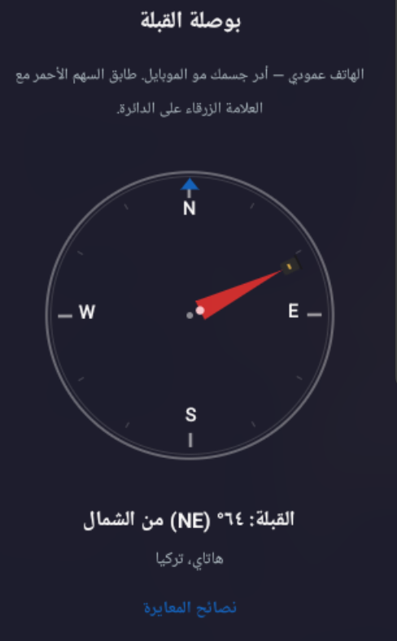

# Hayya (حيا) — حي على الصلاة

**Privacy-first prayer times • Qibla compass • Offline-first • No GPS • No ads**

**تطبيق أوقات صلاة خفي • بوصلة قبلة • خصوصية كاملة • بدون GPS • بدون إعلانات • أوفلاين أولاً**

[English](#english) | [العربية](#arabic)

[](https://github.com/karimVentus/Private-Prayer/actions/workflows/smoke-ci.yml)

Open-source Android app for accurate daily prayer times — pick your city from 4,000+ bundled locations or **enter coordinates manually**, live countdown, optional adhan (including **custom imported sounds**), Qibla compass, home-screen widgets, and a full Hijri calendar. **No tracking, no ads, no GPS.**

---

<a id="english"></a>

# English

**Privacy-first • Simple • Offline-first**

Hayya is an open-source Android prayer-times app built around **privacy** and **simplicity**. Choose your city from a bundled catalog of 4,000+ locations (or enter lat/lng manually when coords are missing), get accurate times (Umm al-Qura + Shafi), a live countdown to the next prayer, optional adhan notifications with **custom sound import**, a portrait Qibla compass with geographic calibration, two home-screen widgets, and a Hijri calendar with ten Islamic events — **without GPS, accounts, or network calls by default**.

| | |
|---|---|
| **Version** | 1.2.0 |
| **Package** | `com.prayertime` |
| **Min SDK** | 23 · **Target** 35 |
| **Tests** | JVM unit tests via `./gradlew testDebugUnitTest` |

### Highlights

- **Privacy by default** — offline-only mode (no network); user can enable optional Aladhan API in Settings
- **Custom adhan** — import and manage your own adhan audio files
- **Qibla compass** — city bearing + geomagnetic correction + accelerometer/magnetometer (no GPS)
- **Manual coordinates** — enter lat/lng in city wizard when a location has no bundled coords (works offline)
- **Widgets** — medium (5×1 schedule) + large (clock + per-prayer countdown); Eastern Arabic digits in AR
- **Hijri calendar** — monthly grid + ten Islamic events
- **Themes** — light, green, dark (app + widgets + calendar)
- **Languages** — English and Arabic with full RTL

---

## Screenshots

### Custom adhan

Import any adhan audio you prefer and assign it in Settings.

### Prayer times

Live countdown, Hijri date, upcoming event banner, per-prayer mute toggles, and offline privacy mode.

| English (light) | Arabic (light) | Arabic (dark) |
|:---:|:---:|:---:|
|  |  |  |

### Home-screen widgets

Two sizes: **medium** (5×1 schedule — Hijri header, prayer names, times, next-prayer column highlight) and **large** (city clock + six columns with per-prayer countdown). Widgets follow the app theme and locale (including Eastern Arabic digits).

| Medium (EN) | Medium (AR) | Medium (AR, dark) |
|:---:|:---:|:---:|
|  |  |  |

| Overview (EN) | Overview (AR) | Overview (AR, dark) |
|:---:|:---:|:---:|
|  |  |  |

| Large (EN) | Large (AR) | Large (AR, dark) |
|:---:|:---:|:---:|
|  |  |  |

### Hijri calendar

Monthly grid with Gregorian pairing, event labels (Arafah, Eid, etc.), and an annual occasions list.

| Monthly calendar | Annual occasions |
|:---:|:---:|
|  |  |

### Qibla compass

Portrait compass using accelerometer + magnetometer; city bearing from bundled coordinates, alignment feedback, and calibration tips.

| Qibla — Arabic, dark theme |
|:---:|
|  |

### Settings & setup

Offline-only privacy toggle, theme picker, adhan notifications, custom sound import, **Share** button, and country/city wizard (4,000+ cities + manual lat/lng, no GPS).

| Settings | City wizard |
|:---:|:---:|
|  |  |

---

## Features

| Area | Details |
|------|---------|
| **Prayer calculation** | Umm al-Qura (Makkah), Shafi Asr, twilight angle at \|lat\| ≥ 48°; Shuruq = sunrise |
| **Privacy** | Default **offline-only** — no network calls; optional Aladhan API when user disables offline mode in Settings |
| **Adhan** | Eight built-in sounds + **custom import**, per-prayer mute, exact-alarm scheduling, Doze-safe `setAlarmClock` |
| **Widgets** | Medium (5×1) + large (clock + columns + countdown); locale + Eastern Arabic digits; theme sync; stale-cache fallback |
| **Hijri** | Calculator + 10 events; main-screen banner; calendar monthly/annual views |
| **i18n** | English / Arabic, RTL layout, in-app language picker |
| **Themes** | Light, green, dark — app + widgets + calendar |
| **Security** | TLS certificate pinning for `aladhan.com` (when network mode enabled) |

---

## Architecture

- **Single APK (`com.prayertime`):** bundled `locations.json` + local `adhan-java` **or** [Aladhan API](https://api.aladhan.com) — user toggles **Offline-only (no network)** in Settings
- **Stack:** Kotlin · Jetpack Compose · Hilt · Room v4 · DataStore · WorkManager · Retrofit/OkHttp (Aladhan only when network mode on)
- **Repository:** `OnlinePrayerTimesRepository` composes local engine + optional API

See [`PHASED_PLAN.md`](PHASED_PLAN.md) for the full roadmap and Mermaid diagrams.

---

## Download

**Easiest path:**

1. Open **[GitHub Releases](https://github.com/karimVentus/Private-Prayer/releases)**
2. Download the latest `Hayya-v1.2.0.apk`
3. Install (allow unknown sources for your browser/files app)
4. Open **Hayya** and complete the city wizard

Or sideload: `adb install -r Hayya-v1.2.0.apk`

Use **Settings → About → Share app** to send the download link to someone else.

---

## Install (release build)

### Maintainers (build + publish)

Requires JDK 21+, Android SDK, `gh` CLI, and a one-time upload keystore (gitignored).

```sh
export JAVA_HOME=$HOME/jdk21   # or Temurin 21
export ANDROID_HOME=$HOME/Android/Sdk

# First time only — pick a strong password and back up ~/prayertime-upload.jks
PRAYERTIME_KEYSTORE_PASSWORD='your-password' ./scripts/setup-release-signing.sh

./scripts/smoke-ci.sh          # full CI before tagging
./scripts/publish-release.sh v1.2.0   # build, package dist/, create GitHub Release
```

| Artifact | Path | Size |
|----------|------|------|
| Signed APK | `dist/release/Hayya-v1.2.0.apk` | ~12 MB |
| Signed AAB | `app/build/outputs/bundle/release/app-release.aab` | Play Store (`PUBLISH_AAB=1`) |

```sh
./scripts/release-gate.sh    # assembleRelease + size gate (≤ 13 MB)
```

---

## Development

```sh
export JAVA_HOME=$HOME/jdk21
export ANDROID_HOME=$HOME/Android/Sdk
./gradlew assembleDebug testDebugUnitTest
```

**Emulator shortcut** (boot → install debug → launch):

```sh
./dev              # installs com.prayertime
./dev --headless
```

Manual install on a running emulator:

```sh
./scripts/emulator-start
./gradlew installDebug
adb shell am start -n com.prayertime/com.prayertime.ui.MainActivity
```

After widget layout changes, remove and re-add the widget on the home screen (launchers cache dimensions). Regenerate README widget PNGs with `./scripts/export-readme-widget-screenshots.sh`.

---

## Tests

```sh
./gradlew testDebugUnitTest
```

Full gate: `./scripts/smoke-ci.sh` (build, lint, detekt, APK size).

Requires JDK 21 (`$HOME/jdk21`); system JDK 25 breaks the current Gradle/AGP toolchain.

---

## Documentation

| Doc | Purpose |
|-----|---------|
| [`PHASED_PLAN.md`](PHASED_PLAN.md) | Roadmap, phase gates, Graphify |
| [`APP_CREATION_PLAYBOOK.md`](APP_CREATION_PLAYBOOK.md) | Engineering playbook + feature table |
| [`docs/PRIVACY.md`](docs/PRIVACY.md) | Privacy model |
| [`CONTRIBUTING.md`](CONTRIBUTING.md) | Contribution guidelines for developers |
| [`SECURITY.md`](SECURITY.md) | Security policy and vulnerability reporting |
| [`graphity.md`](graphity.md) | Knowledge-graph maintenance |
| [`AGENTS.md`](AGENTS.md) | Build environment for agents/CI |

---

## License

Open source — see the repository license file. Prayer calculation uses [`adhan-java`](https://github.com/batoulapps/adhan-java) (Umm al-Qura).

---

<a id="arabic"></a>

# العربية

**حي على الصلاة — خصوصية أولاً • بساطة • أوفلاين أولاً**

**Hayya** تطبيق أندرويد مفتوح المصدر يركز على **الخصوصية** و**البساطة**. اختر مدينتك من أكثر من **4000 مدينة** مدمجة (أو أدخل الإحداثيات يدوياً)، واحصل على أوقات صلاة دقيقة (أم القرى + الشافعي)، عد تنازلي حي، أذان مخصص (استيراد ملفاتك الخاصة)، بوصلة قبلة مع معايرة جغرافية، ويدجيتس، وتقويم هجري كامل — **بدون تتبع أو إعلانات أو GPS**.

| | |
|---|---|
| **الإصدار** | 1.2.0 |
| **حزمة التطبيق** | `com.prayertime` |
| **الحد الأدنى لـ SDK** | 23 · **المستهدف** 35 |
| **الاختبارات** | `./gradlew testDebugUnitTest` |

### أبرز المميزات

- **خصوصية قصوى**: وضع أوفلاين افتراضي (لا طلبات شبكة)، يمكن إيقاف الشبكة كلياً من الإعدادات
- **أذان مخصص**: استيراد وإدارة ملفات الصوت الخاصة بك
- **بوصلة قبلة**: تعمل بدون GPS باستخدام إحداثيات المدينة والتصحيح الجغرافي وحساسات الهاتف
- **إحداثيات يدوية**: أدخل خط العرض/الطول في معالج المدينة عند غياب الإحداثيات المدمجة (يعمل أوفلاين)
- **ويدجيتس**: متوسطة + كبيرة مع عد تنازلي + أرقام عربية شرقية
- **تقويم هجري**: شهري + مناسبات إسلامية (10 مناسبات)
- **ثيمات**: فاتح، أخضر، داكن (تنطبق على التطبيق + الويدجيتس)
- **دعم كامل**: عربي + RTL + إنجليزي

---

## لقطات الشاشة (Screenshots)

### أذان مخصص

استورد أي صوت أذان تريده واستخدمه للصلاة من الإعدادات.

### أوقات الصلاة

عد تنازلي مباشر، التاريخ الهجري، شريط المناسبات الإسلامية القادمة، مفاتيح كتم الصوت لكل صلاة، ووضع الخصوصية دون اتصال بالشبكة.

| English (light) | Arabic (light) | Arabic (dark) |
|:---:|:---:|:---:|
|  |  |  |

### أدوات الشاشة الرئيسية (Widgets)

حجمان: **متوسط** (جدول 5×1 — ترويسة هجرية، أسماء الصلوات، الأوقات، تمييز عمود الصلاة القادمة) و**كبير** (ساعة المدينة + ستة أعمدة مع عد تنازلي لكل صلاة). تتبع الأدوات مظهر التطبيق واللغة (بما في ذلك الأرقام العربية الشرقية).

| Medium (EN) | Medium (AR) | Medium (AR, dark) |
|:---:|:---:|:---:|
|  |  |  |

| Overview (EN) | Overview (AR) | Overview (AR, dark) |
|:---:|:---:|:---:|
|  |  |  |

| Large (EN) | Large (AR) | Large (AR, dark) |
|:---:|:---:|:---:|
|  |  |  |

### التقويم الهجري

شبكة تقويم شهرية مقترنة بالتقويم الميلادي، وتسميات المناسبات الإسلامية (عرفة، الأعياد، إلخ)، وقائمة بالمناسبات السنوية.

| Monthly calendar | Annual occasions |
|:---:|:---:|
|  |  |

### بوصلة القبلة

بوصلة عمودية (مستشعر تسارع + مغناطيسية)، اتجاه القبلة من إحداثيات المدينة، تنبيه عند المحاذاة، ونصائح معايرة.

| بوصلة القبلة — عربي، سمة داكنة |
|:---:|
|  |

### الإعدادات وإعدادات التشغيل الأول

مفتاح الخصوصية للعمل دون اتصال بالشبكة، مغير السمة، تنبيهات الأذان، استيراد أذان مخصص، زر **مشاركة التطبيق**، ومعالج إعداد الدولة والمدينة (أكثر من 4000 مدينة + إحداثيات يدوية، دون GPS).

| Settings | City wizard |
|:---:|:---:|
|  |  |

---

## الميزات (Features)

| القسم | التفاصيل |
|------|---------|
| **حساب أوقات الصلاة** | تقويم أم القرى (مكة المكرمة)، مذهب الشافعي للعصر، تعديل زاوية الشفق لخطوط العرض \|lat\| ≥ 48°؛ وقت الشروق = شروق الشمس |
| **الخصوصية** | افتراضياً **دون اتصال بالشبكة** — لا اتصالات شبكة؛ Aladhan اختياري من الإعدادات |
| **الأذان** | ثمانية أصوات مدمجة + **استيراد مخصص**، كتم لكل صلاة، جدولة إنذار دقيق، متوافق مع Doze عبر `setAlarmClock` |
| **الأدوات (Widgets)** | متوسط (5×1) + كبير (ساعة + أعمدة + عد تنازلي)؛ دعم اللغة والأرقام العربية الشرقية؛ مزامنة السمة |
| **التقويم الهجري** | حاسبة هجرية + 10 مناسبات؛ شريط في الشاشة الرئيسية؛ عرض شهري وسنوي |
| **تعدد اللغات** | عربي وإنجليزي، RTL كامل، محدد لغة داخل التطبيق |
| **السمات** | فاتح، أخضر، داكن — التطبيق والأدوات والتقويم |
| **الأمان** | تثبيت شهادة TLS لـ `aladhan.com` عند تفعيل وضع الشبكة |

---

## البنية البرمجية (Architecture)

- **APK واحد (`com.prayertime`):** `locations.json` + `adhan-java` **أو** [Aladhan API](https://api.aladhan.com) — toggle **دون اتصال** من الإعدادات
- **التقنيات:** Kotlin · Jetpack Compose · Hilt · Room v4 · DataStore · WorkManager

راجع [`PHASED_PLAN.md`](PHASED_PLAN.md) لخارطة الطريق ومخططات Mermaid.

---

## تنزيل التطبيق

**أسهل طريقة:**

1. اذهب إلى **[إصدارات GitHub](https://github.com/karimVentus/Private-Prayer/releases)**
2. حمّل آخر إصدار `Hayya-v1.2.0.apk`
3. ثبّت التطبيق (اسمح بالمصادر غير المعروفة)
4. افتح **حيا** وأكمل معالج المدينة

أو عبر USB: `adb install -r Hayya-v1.1.6.apk`

من داخل التطبيق: **الإعدادات → حول → مشاركة التطبيق** لإرسال رابط التنزيل.

---

## التثبيت (بناء النسخة النهائية)

### للمطورين (بناء ونشر)

```sh
export JAVA_HOME=$HOME/jdk21
export ANDROID_HOME=$HOME/Android/Sdk
PRAYERTIME_KEYSTORE_PASSWORD='your-password' ./scripts/setup-release-signing.sh
./scripts/publish-release.sh v1.2.0
```

| الملف الناتج | المسار | الحجم |
|----------|------|------|
| APK موقع | `dist/release/Hayya-v1.1.6.apk` | ~12 ميجابايت |
| AAB موقع | `app/build/outputs/bundle/release/app-release.aab` | متجر Google Play |

```sh
./scripts/release-gate.sh   # التحقق من حجم الـ APK (≤ 13 ميجابايت)
./scripts/smoke-ci.sh       # اختبار CI الكامل قبل الدمج أو التوسيم
```

---

## التطوير (Development)

```sh
export JAVA_HOME=$HOME/jdk21
export ANDROID_HOME=$HOME/Android/Sdk
./gradlew assembleDebug testDebugUnitTest
```

**اختصار المحاكي:**

```sh
./dev              # com.prayertime
./dev --headless
```

تثبيت يدوي:

```sh
./scripts/emulator-start
./gradlew installDebug
adb shell am start -n com.prayertime/com.prayertime.ui.MainActivity
```

بعد تغيير تخطيط الأدوات، أزل الويدجيت وأعد إضافته. لتحديث صور README: `./scripts/export-readme-widget-screenshots.sh`.

---

## الاختبارات (Tests)

```sh
./gradlew testDebugUnitTest
```

البوابة الكاملة: `./scripts/smoke-ci.sh`.

يتطلب JDK 21 (`$HOME/jdk21`).

---

## المستندات (Documentation)

| المستند | الغرض |
|-----|---------|
| [`PHASED_PLAN.md`](PHASED_PLAN.md) | خارطة الطريق، بوابات المراحل، Graphify |
| [`APP_CREATION_PLAYBOOK.md`](APP_CREATION_PLAYBOOK.md) | دليل الهندسة + جدول الميزات |
| [`docs/PRIVACY.md`](docs/PRIVACY.md) | نموذج الخصوصية |
| [`CONTRIBUTING.md`](CONTRIBUTING.md) | إرشادات المساهمة |
| [`SECURITY.md`](SECURITY.md) | سياسة الأمان |
| [`graphity.md`](graphity.md) | صيانة Knowledge-Graph |
| [`AGENTS.md`](AGENTS.md) | بيئة البناء للوكلاء والـ CI |

---

## الترخيص (License)

مفتوح المصدر — راجع ملف الترخيص في المستودع. حساب أوقات الصلاة يعتمد على [`adhan-java`](https://github.com/batoulapps/adhan-java) (تقويم أم القرى).
