# Hayya (حيا)

[English](#english) | [العربية](#arabic)

[](https://github.com/karimVentus/Private-Prayer/actions/workflows/smoke-ci.yml)

---

<a id="english"></a>

# English

**Privacy-first Android prayer times — no GPS, no account.**

Pick a country and city from a bundled catalog, get accurate daily times (Umm al-Qura, Shafi), live countdown to the next prayer, optional adhan notifications, two home-screen widgets (medium + large), and a Hijri calendar with ten Islamic events. English and Arabic with full RTL support; three themes (light, green, dark).

| | |
|---|---|
| **Version** | 1.1.2 |
| **Package** | `com.prayertime` |
| **Min SDK** | 23 · **Target** 35 |
| **Tests** | JVM unit tests via `./gradlew testDebugUnitTest` |

---

## Screenshots

### Prayer times

Live countdown, Hijri date, upcoming event banner, per-prayer mute toggles, and offline privacy mode.

| English (light) | Arabic (light) | Arabic (dark) |
|:---:|:---:|:---:|
| 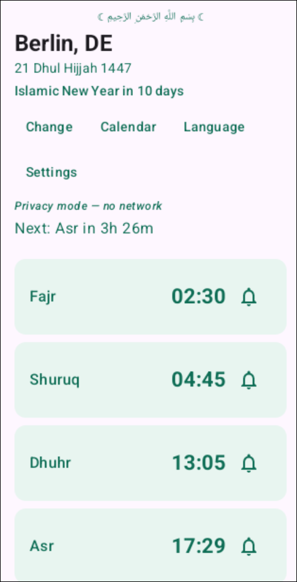 | 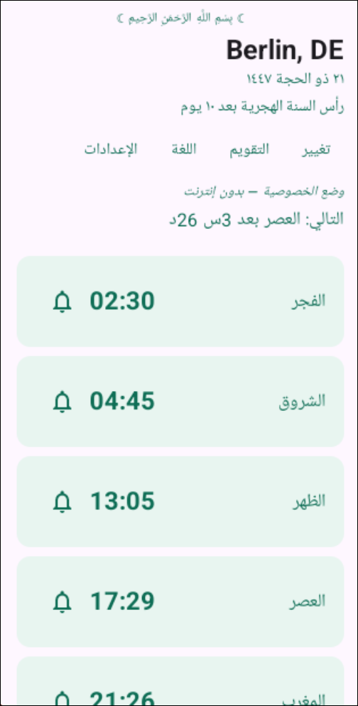 | 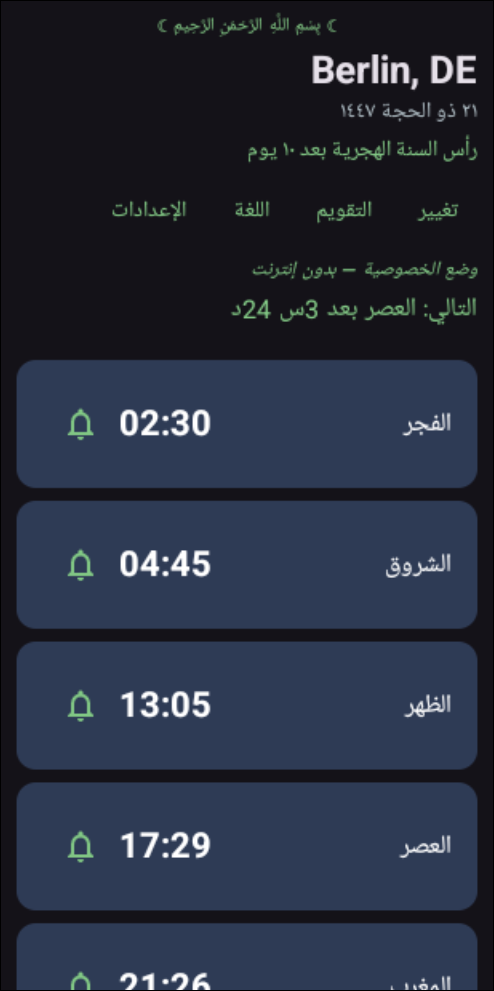 |

### Home-screen widgets

Two sizes: **medium** (5×1 schedule — Hijri header, prayer names, times, next-prayer column highlight) and **large** (city clock + six columns with per-prayer countdown). Widgets follow the app theme and locale (including Eastern Arabic digits).

| Medium (EN) | Medium (AR) | Medium (AR, dark) |
|:---:|:---:|:---:|
| 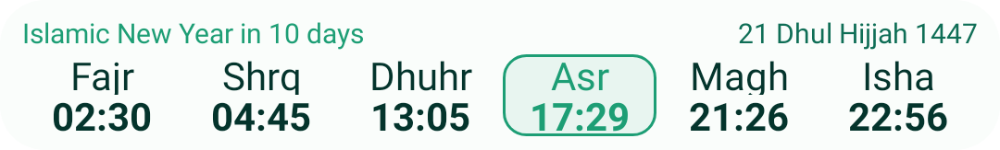 |  |  |

| Overview (EN) | Overview (AR) | Overview (AR, dark) |
|:---:|:---:|:---:|
| 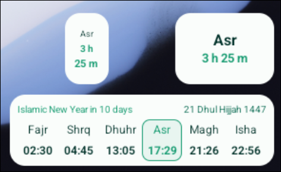 | 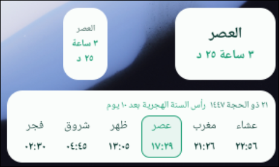 | 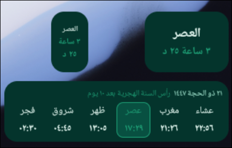 |

| Large (EN) | Large (AR) | Large (AR, dark) |
|:---:|:---:|:---:|
| 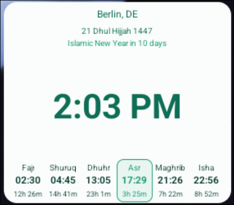 | 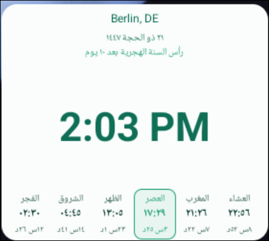 | 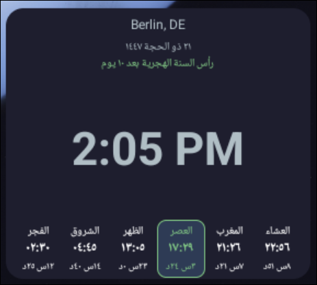 |

### Hijri calendar

Monthly grid with Gregorian pairing, event labels (Arafah, Eid, etc.), and an annual occasions list.

| Monthly calendar | Annual occasions |
|:---:|:---:|
| 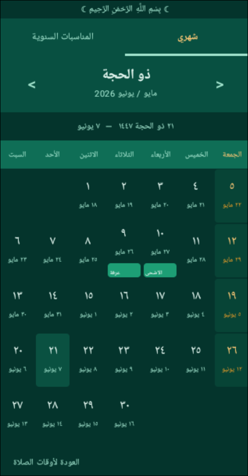 | 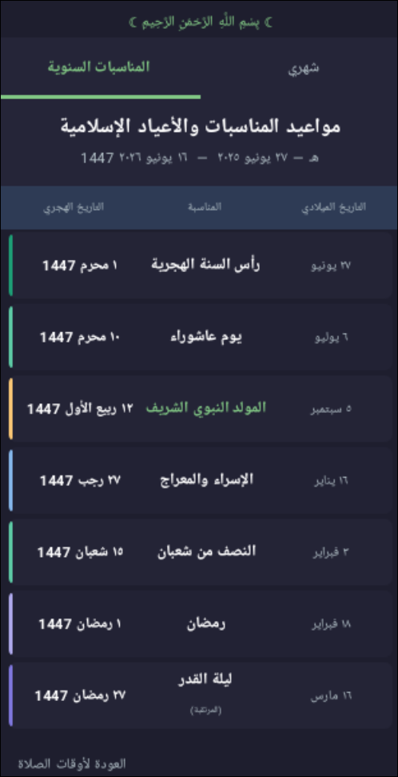 |

### Settings & setup

Offline-only privacy toggle, theme picker, adhan notifications, and country/city wizard (4,000+ cities, no GPS).

| Settings | City wizard |
|:---:|:---:|
| 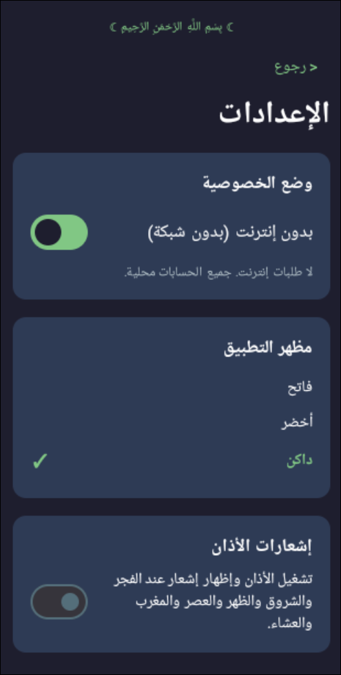 | 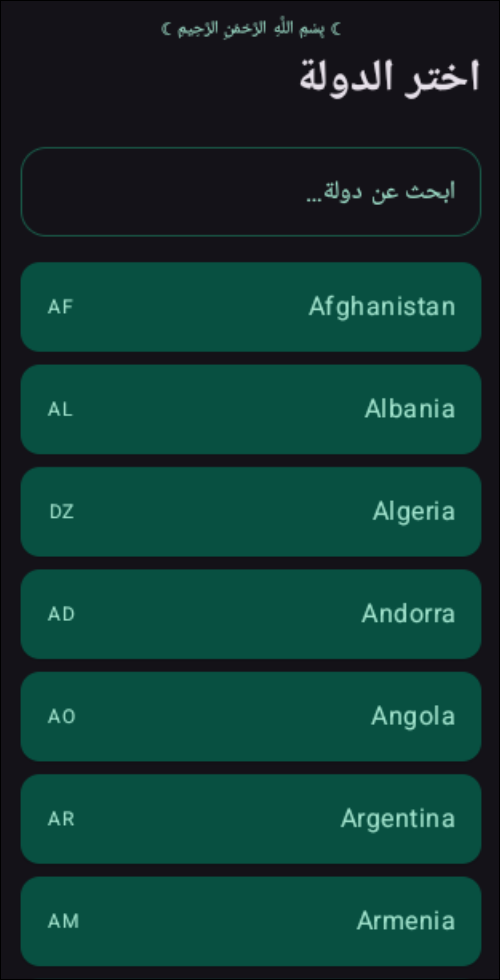 |

---

## Features

| Area | Details |
|------|---------|
| **Prayer calculation** | Umm al-Qura (Makkah), Shafi Asr, twilight angle at \|lat\| ≥ 48°; Shuruq = sunrise |
| **Privacy** | Default **offline-only** — no network calls; optional Aladhan API when user disables offline mode in Settings |
| **Adhan** | Eight sounds, per-prayer mute, exact-alarm scheduling, Doze-safe `setAlarmClock` |
| **Widgets** | Medium (5×1) + large (clock + columns); locale + Eastern Arabic digits; theme sync; stale-cache fallback |
| **Hijri** | Calculator + 10 events; main-screen banner; calendar monthly/annual views |
| **i18n** | English / Arabic, RTL layout, in-app language picker |
| **Themes** | Light, green, dark — app + widgets + calendar |
| **Security** | TLS certificate pinning for `aladhan.com` (when network mode enabled) |

---

## Architecture

- **Single APK (`com.prayertime`):** bundled `locations.json` + local `adhan-java` **or** [Aladhan API](https://api.aladhan.com) — user toggles **Offline-only (no network)** in Settings
- **Stack:** Kotlin · Jetpack Compose · Hilt · Room v4 · DataStore · WorkManager · Retrofit/OkHttp (Aladhan only when network mode on)
- **Repository:** `OnlinePrayerTimesRepository` composes local engine + optional API

See [`PHASED_PLAN.md`](PHASED_PLAN.md) for the full roadmap and Mermaid diagrams.

---

## Install (release)

### Users (download APK)

Get the latest signed APK from **[GitHub Releases](https://github.com/karimVentus/Private-Prayer/releases)** (`Hayya-v*.apk`).

1. Download the APK on your phone (or sideload via `adb install -r Hayya-v1.1.2.apk`).
2. Allow install from your browser/files app when prompted (Android “unknown sources”).
3. Open **Hayya** and complete the city wizard.

### Maintainers (build + publish)

Requires JDK 21+, Android SDK, `gh` CLI, and a one-time upload keystore (gitignored).

```sh
export JAVA_HOME=$HOME/jdk21   # or Temurin 21
export ANDROID_HOME=$HOME/Android/Sdk

# First time only — pick a strong password and back up ~/prayertime-upload.jks
PRAYERTIME_KEYSTORE_PASSWORD='your-password' ./scripts/setup-release-signing.sh

./scripts/smoke-ci.sh          # full CI before tagging
./scripts/publish-release.sh v1.1.2   # build, package dist/, create GitHub Release
```

| Artifact | Path | Size |
|----------|------|------|
| Signed APK | `dist/release/Hayya-v1.1.2.apk` | ~12 MB |
| Signed AAB | `app/build/outputs/bundle/release/app-release.aab` | Play Store (`PUBLISH_AAB=1`) |

```sh
./scripts/release-gate.sh    # assembleRelease + size gate (≤ 13 MB)
```

---

## Development

```sh
export JAVA_HOME=$HOME/jdk21
export ANDROID_HOME=$HOME/Android/Sdk
./gradlew assembleDebug testDebugUnitTest
```

**Emulator shortcut** (boot → install debug → launch):

```sh
./dev              # installs com.prayertime
./dev --headless
```

Manual install on a running emulator:

```sh
./scripts/emulator-start
./gradlew installDebug
adb shell am start -n com.prayertime/com.prayertime.ui.MainActivity
```

After widget layout changes, remove and re-add the widget on the home screen (launchers cache dimensions). Regenerate README widget PNGs with `./scripts/export-readme-widget-screenshots.sh`.

---

## Tests

```sh
./gradlew testDebugUnitTest
```

Full gate: `./scripts/smoke-ci.sh` (build, lint, detekt, APK size).

Requires JDK 21 (`$HOME/jdk21`); system JDK 25 breaks the current Gradle/AGP toolchain.

---

## Documentation

| Doc | Purpose |
|-----|---------|
| [`PHASED_PLAN.md`](PHASED_PLAN.md) | Roadmap, phase gates, Graphify |
| [`APP_CREATION_PLAYBOOK.md`](APP_CREATION_PLAYBOOK.md) | Engineering playbook + feature table |
| [`docs/PRIVACY.md`](docs/PRIVACY.md) | Privacy model |
| [`CONTRIBUTING.md`](CONTRIBUTING.md) | Contribution guidelines for developers |
| [`SECURITY.md`](SECURITY.md) | Security policy and vulnerability reporting |
| [`graphity.md`](graphity.md) | Knowledge-graph maintenance |
| [`AGENTS.md`](AGENTS.md) | Build environment for agents/CI |

---

## License

See repository license file. Prayer calculation uses [`adhan-java`](https://github.com/batoulapps/adhan-java) (Umm al-Qura).

---

<a id="arabic"></a>

# العربية

**حيا — تطبيق أوقات صلاة يركز على الخصوصية، بدون GPS وبدون حساب.**

اختر الدولة والمدينة من دليل مدمج داخل التطبيق، واحصل على أوقات صلاة يومية دقيقة (تقويم أم القرى، والمذهب الشافعي)، وعد تنازلي مباشر للصلاة القادمة، وتنبيهات أذان اختيارية، وأداتين للشاشة الرئيسية (متوسطة + كبيرة)، وتقويم هجري مع عشرة مناسبات إسلامية. التطبيق متوفر باللغتين العربية والإنجليزية مع دعم كامل للاتجاه من اليمين إلى اليسار (RTL)، وثلاثة سمات (مظهر فاتح، أخضر، داكن).

| | |
|---|---|
| **الإصدار** | 1.1.1 |
| **حزمة التطبيق** | `com.prayertime` |
| **الحد الأدنى لـ SDK** | 23 · **المستهدف** 35 |
| **الاختبارات** | `./gradlew testDebugUnitTest` |

---

## لقطات الشاشة (Screenshots)

### أوقات الصلاة

عد تنازلي مباشر، التاريخ الهجري، شريط المناسبات الإسلامية القادمة، مفاتيح كتم الصوت لكل صلاة، ووضع الخصوصية دون اتصال بالشبكة.

| English (light) | Arabic (light) | Arabic (dark) |
|:---:|:---:|:---:|
|  |  |  |

### أدوات الشاشة الرئيسية (Widgets)

حجمان: **متوسط** (جدول 5×1 — ترويسة هجرية، أسماء الصلوات، الأوقات، تمييز عمود الصلاة القادمة) و**كبير** (ساعة المدينة + ستة أعمدة مع عد تنازلي لكل صلاة). تتبع الأدوات مظهر التطبيق واللغة (بما في ذلك الأرقام العربية الشرقية).

| Medium (EN) | Medium (AR) | Medium (AR, dark) |
|:---:|:---:|:---:|
|  |  |  |

| Overview (EN) | Overview (AR) | Overview (AR, dark) |
|:---:|:---:|:---:|
|  |  |  |

| Large (EN) | Large (AR) | Large (AR, dark) |
|:---:|:---:|:---:|
|  |  |  |

### التقويم الهجري

شبكة تقويم شهرية مقترنة بالتقويم الميلادي، وتسميات المناسبات الإسلامية (عرفة، الأعياد، إلخ)، وقائمة بالمناسبات السنوية.

| Monthly calendar | Annual occasions |
|:---:|:---:|
|  |  |

### الإعدادات وإعدادات التشغيل الأول

مفتاح الخصوصية للعمل دون اتصال بالشبكة بالكامل، مغير السمة، تنبيهات الأذان، ومعالج إعداد الدولة والمدينة (أكثر من 4000 مدينة، دون الحاجة لـ GPS).

| Settings | City wizard |
|:---:|:---:|
|  |  |

---

## الميزات (Features)

| القسم | التفاصيل |
|------|---------|
| **حساب أوقات الصلاة** | تقويم أم القرى (مكة المكرمة)، مذهب الشافعي للعصر، تعديل زاوية الشفق لخطوط العرض |lat| ≥ 48°؛ وقت الشروق = شروق الشمس |
| **الخصوصية** | افتراضياً **دون اتصال بالشبكة** — لا اتصالات شبكة؛ Aladhan اختياري من الإعدادات |
| **الأذان** | ثمانية أصوات للأذان، إمكانية كتم الصوت لكل صلاة على حدة، جدولة التنبيهات باستخدام ميزة الإنذار الدقيق، متوافق مع وضع Doze للحفاظ على البطارية عبر `setAlarmClock` |
| **الأدوات (Widgets)** | متوسط (5×1) + كبير (ساعة + أعمدة)؛ دعم اللغة والأرقام العربية الشرقية؛ مزامنة السمة؛ ذاكرة مؤقتة عند التأخر |
| **التقويم الهجري** | حاسبة هجرية مدمجة مع 10 مناسبات إسلامية؛ شريط إعلاني للمناسبات في الشاشة الرئيسية؛ عرض شهري وسنوي للتقويم |
| **تعدد اللغات** | دعم كامل للغتين العربية والإنجليزية، اتجاه كامل من اليمين إلى اليسار (RTL)، ومحدد لغة مدمج في التطبيق |
| **السمات** | ثلاثة سمات (فاتح، أخضر، داكن) تشمل التطبيق والأدوات والتقويم |
| **الأمان** | تثبيت شهادة TLS لـ `aladhan.com` عند تفعيل وضع الشبكة |

---

## البنية البرمجية (Architecture)

- **APK واحد (`com.prayertime`):** `locations.json` + `adhan-java` **أو** [Aladhan API](https://api.aladhan.com) — toggle **دون اتصال** من الإعدادات
- **التقنيات:** Kotlin · Jetpack Compose · Hilt · Room v4 · DataStore · WorkManager

راجع ملف [`PHASED_PLAN.md`](PHASED_PLAN.md) للاطلاع على خارطة الطريق الكاملة ومخططات Mermaid.

---

## التثبيت (النسخة النهائية - Release)

### للمستخدمين (تنزيل APK)

حمّل أحدث APK موقّع من **[إصدارات GitHub](https://github.com/karimVentus/Private-Prayer/releases)** (`PrayerTime-v*.apk`).

1. نزّل الملف على هاتفك (أو ثبّت عبر `adb install -r Hayya-v1.1.2.apk`).
2. اسمح بالتثبيت من المتصفح/مدير الملفات عند الطلب.
3. افتح التطبيق وأكمل معالج اختيار المدينة.

### للمطورين (بناء ونشر)

```sh
export JAVA_HOME=$HOME/jdk21
export ANDROID_HOME=$HOME/Android/Sdk
PRAYERTIME_KEYSTORE_PASSWORD='your-password' ./scripts/setup-release-signing.sh
./scripts/publish-release.sh v1.1.2
```

| الملف الناتج | المسار | الحجم |
|----------|------|------|
| APK موقع | `app/build/outputs/apk/release/app-release.apk` | ~12 ميجابايت |
| AAB موقع | `app/build/outputs/bundle/release/app-release.aab` | متجر Google Play |

```sh
./scripts/release-gate.sh   # التحقق من حجم الـ APK (يجب أن يكون ≤ 13 ميجابايت)
./scripts/smoke-ci.sh       # اختبار الـ CI الكامل قبل الدمج أو التوسيم
```

---

## التطوير (Development)

```sh
export JAVA_HOME=$HOME/jdk21
export ANDROID_HOME=$HOME/Android/Sdk
./gradlew assembleDebug testDebugUnitTest
```

**اختصار المحاكي:**

```sh
./dev              # com.prayertime
./dev --headless
```

تثبيت يدوي:

```sh
./scripts/emulator-start
./gradlew installDebug
adb shell am start -n com.prayertime/com.prayertime.ui.MainActivity
```

بعد تغيير تخطيط الأدوات (Widgets)، قم بإزالتها وإعادة إضافتها إلى الشاشة الرئيسية (تقوم واجهات التشغيل بحفظ الأبعاد مؤقتاً). لتحديث صور README للأدوات: `./scripts/export-readme-widget-screenshots.sh`.

---

## الاختبارات (Tests)

```sh
./gradlew testDebugUnitTest
```

البوابة الكاملة: `./scripts/smoke-ci.sh`.

يتطلب التثبيت إصدار JDK 21 (`$HOME/jdk21`)؛ حيث أن إصدار نظام JDK 25 يسبب مشاكلاً مع بيئة Gradle/AGP الحالية.

---

## المستندات (Documentation)

| المستند | الغرض |
|-----|---------|
| [`PHASED_PLAN.md`](PHASED_PLAN.md) | خارطة الطريق، بوابات المراحل، Graphify |
| [`APP_CREATION_PLAYBOOK.md`](APP_CREATION_PLAYBOOK.md) | دليل الهندسة البرمجية + جدول الميزات |
| [`docs/PRIVACY.md`](docs/PRIVACY.md) | نموذج سياسة الخصوصية |
| [`CONTRIBUTING.md`](CONTRIBUTING.md) | إرشادات المساهمة للمطورين |
| [`SECURITY.md`](SECURITY.md) | سياسة الأمان والإبلاغ عن الثغرات |
| [`graphity.md`](graphity.md) | صيانة شجرة المعرفة (Knowledge-Graph) |
| [`AGENTS.md`](AGENTS.md) | بيئة البناء والتشغيل للوكلاء والـ CI |

---

## الترخيص (License)

راجع ملف الترخيص المرفق في المستودع. يعتمد حساب أوقات الصلاة على مكتبة [`adhan-java`](https://github.com/batoulapps/adhan-java) (تقويم أم القرى).
