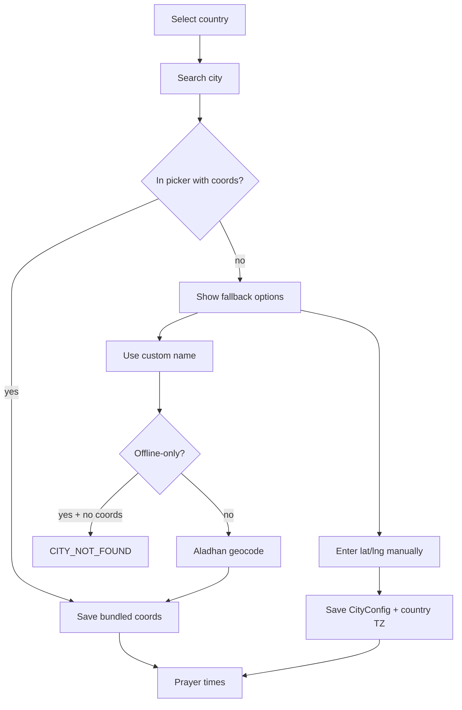

# Phase 8 — City catalog coordinates + manual entry

**Status:** Planned (not started in code). Branch from `main`.

---

## Problem

`locations.json` has **2,056** picker cities but only **~1,049** `knownCityCoords` (~51%). In **offline-only mode** (default), cities without exact coords are rejected (`CITY_NOT_FOUND`).

**Europe baseline (Jun 2026):** 599 picker cities / 134 with exact coords. Germany (`DE`) is complete; most other EU countries have 0 exact coords.

---

## Regional data order

Fill coordinates in this order:

1. **Europe**
2. **Africa**
3. **Asia**
4. **America**

Scripts:

- `scripts/expand_locations.py` — add coords + picker lists
- `scripts/generate-cities-ar.py` — regenerate Arabic city names after picker changes

---

## Wizard flow (target UX)

1. Select country → search city.
2. **Path A** — city in picker with bundled coords → save (existing).
3. **Path B** — no match or no coords:
   - **B1** — *Use "&lt;name&gt;"* — custom name; online geocode when offline coords absent (existing).
   - **B2** — **Enter coordinates manually** (new) — city name + latitude + longitude; hint to copy from [latlong.net](https://www.latlong.net/) or Google Maps long-press; timezone from `countryDefaults`; saves `CityConfig` with lat/lng → works **offline** (prayer times + Qibla).



---

## Tasks

### 8A — Manual coordinates UI (ship first)

- [ ] **8A.1** `WizardStep.ManualCoordinates` + lat/lng fields, validation, EN/AR copy
- [ ] **8A.2** `saveCityWithManualCoordinates()` — bypass fallback rejection
- [ ] **8A.3** Show manual-entry card when search empty or “coordinates not found?”
- [ ] **8A.4** Unit tests — offline save, invalid coords rejected, country TZ

### 8B–8E — Regional coord fill

- [ ] **8B** Europe (~465 missing)
- [ ] **8C** Africa
- [ ] **8D** Asia
- [ ] **8E** America

### 8F — Release

- [ ] Update README catalog note; version bump; APK size gate

---

## Branching

```sh
git checkout main && git pull
git checkout -b feat/city-coords-europe   # or feat/manual-coords-wizard for 8A
./scripts/smoke-ci.sh                     # before merge
```

Implement **8A before 8B** so users have a fallback while the catalog fills.
