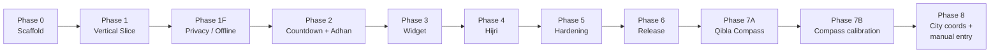

# Roadmap

Phases **0–7A** are complete on `main` (Jun 2026). **Phase 8** is the active plan.

---

## Completed phases

| Phase | Summary | Status |
|-------|---------|--------|
| **0** | Scaffold — Compose, Hilt, Room, Gradle | Done |
| **1** | City wizard + prayer times (Aladhan + adhan-java hybrid) | Done |
| **1F** | Offline-only default; privacy UI; fallback rejection | Done |
| **2** | Live countdown, adhan alarms, WorkManager refresh | Done |
| **2G–2H** | Hilt hardening, locale EN/AR, RTL, LocationRepository | Done |
| **3** | Medium (5×1) + large home-screen widgets | Done |
| **4** | Hijri calendar + 10 Islamic events, Room v4 | Done |
| **5** | Hardening, themes, per-prayer mute, custom adhan, manual QA | Done |
| **6** | R8 release — **v1.0.0** signed APK/AAB | Done |
| **7A** | Qibla compass (city bearing + accel/mag, portrait) | Done |

---

## Active: Phase 7B

**Goal:** Geographic declination correction, portrait tilt gating, and clearer calibration UI on `QiblaScreen`.

| Task block | Scope |
|------------|-------|
| **7B.1–7B.3** | `CompassGeographicField`, `CompassUprightGate`, accuracy chip, auto tips |
| **7B.4–7B.6** | Optional fine-offset, device QA, release |

---

## Next: Phase 8

**Goal:** Offline-first city setup worldwide — bundled coordinates for picker cities plus manual lat/lng entry when coords are missing.

| Task block | Scope |
|------------|-------|
| **8A** | Manual coordinates UI in city wizard — **done** |
| **8B** | Europe `knownCityCoords` fill (574 cities) — **done** (PR **#43**) |
| **8C** | Africa `knownCityCoords` fill (407 cities) — **done** (PR **#44**) |
| **8D** | Asia `knownCityCoords` fill (920 cities) — **done** (PR **#45**) |
| **8E** | Americas `knownCityCoords` fill (105 cities) — **done** (PR **#46**) |
| **8F** | Catalog tail AU/RU/BY/NZ — **done** (PR **#47**) |
| **8C.4 / 8G** | Fill empty Africa + remaining 38 countries — **2766/2766** — **done** |
| **Release v1.2.0** | Tag + GitHub APK after **#47** merge |

Details: [Phase 8 — City catalog](Phase-8-City-Catalog)

---

## Out of scope

- GPS / auto-location
- Adhkar / dhikr modules
- Landscape layouts (app is **portrait-only**)

---

## Canonical doc

Full task checklists and architecture diagrams live in [PHASED_PLAN.md](https://github.com/karimVentus/Private-Prayer/blob/main/PHASED_PLAN.md) on `main`.
